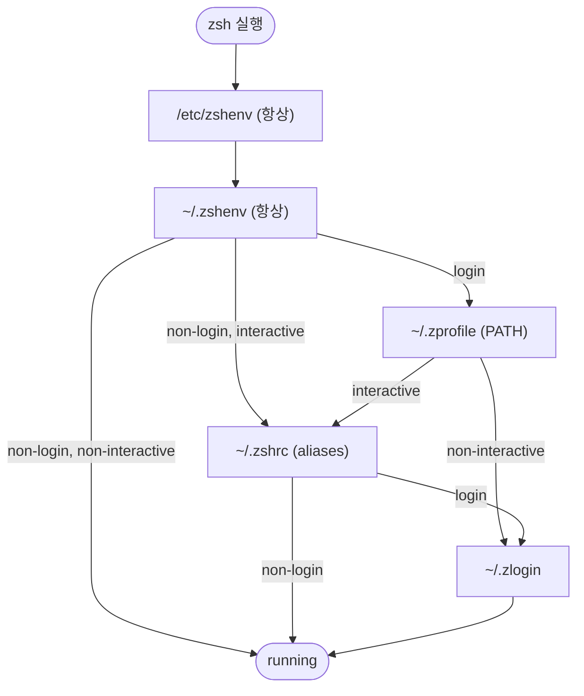

## 개요
---
### Zsh
```sh
echo $SHELL
/bin/zsh
```
- Zsh 는 Kernel 에 명령어를 보낼 수 있는 일종의 [[02. OS#Shell|Shell]] 이다.
- macOS Catalina 이후 제공되는 기본 Shell 로 `oh-my-zsh` 등 플러그인을 통해 사용자 편의 기능이 많이 제공된다.
- `/bin/zsh` 에 위치한다.

### Zsh 설정
Zsh 는 설정 파일이 `.zshenv`, `.zprofile`, `.zshrc`, `.zlogin`, `.zlogout` 총 5개로 나뉘어져있다. 굳이 5개로 분리한 이유는 셸이 어떤 종류로 뜨느냐에 따라 읽히는 파일이 다르기 때문이다. 환경변수는 어디서든 필요하지만, alias/프롬프트는 사람이 명령을 치는 interactive shell 상황일 때만 필요하다. 이 구분을 알아야 "왜 alias가 스크립트에선 안 먹지", "왜 이 export를 여기 넣어야 하지"가 풀린다.
- 각 파일에 뭘 넣을지는 셸 종류 2축(login/non-login, interactive/non-interactive)으로 결정된다.
- 설정 파일의 위치는 `ZDOTDIR` 로 바꿀 수 있다. 기본은 `$HOME`.

## Shell 의 종류
---
Zsh 는 실행될 때 두 가지 축으로 자신을 분류하고, 그에 맞는 설정 파일만 읽는다.

login vs non-login
- login shell = 로그인 절차를 거쳐 뜨는 셸. SSH 접속, macOS 에서 터미널 새 창.
- non-login shell = 이미 로그인된 상태에서 뜨는 셸. 기존 셸에서 `zsh` 입력, 대부분의 리눅스 GUI 터미널 창.

interactive vs non-interactive
- interactive shell = 프롬프트를 띄우고 사람 입력을 받는 셸.
- non-interactive shell = 사람 없이 도는 셸. 스크립트 실행(`./foo.sh`), cron 작업.

이 둘은 독립이라 조합된다. 예를 들어:
- macOS 터미널 새 창 = login + interactive.
- `bash`/`zsh`로 스크립트 실행 = non-login + non-interactive.

## zsh 설정 파일 5개
---
- `.zshenv` = 모든 셸에서 항상 읽힘(스크립트 포함). `PATH`, `EDITOR`, `XDG_*` 같이 어디서든 필요한 환경변수만. 매 스크립트 실행마다 읽히므로 무겁게 만들지 않는다.
- `.zprofile` = login shell에서 `.zshrc` 전에 1회. 로그인 시 한 번만 하면 되는 초기화(무거운 `PATH` 조립 등).
- `.zshrc` = interactive shell 에서만. alias, 프롬프트, 키바인딩, 자동완성 등 사람이 명령을 칠 때 필요한 전부.
- `.zlogin` = login shell 에서 `.zshrc` 후에. `.zprofile` 의 대안(둘 중 취향껏). 셸 준비가 끝난 뒤 실행할 것.
- `.zlogout` = login shell 종료 시. 정리 작업(임시파일 삭제 등).

핵심 감각: 환경변수 → `.zshenv`, 사람용 편의(alias/프롬프트) → `.zshrc`. 나머지 셋은 특수 목적이라 처음엔 거의 안 쓴다.

## 로딩 순서
---
공식 Zsh 문서 기준 순서. `/etc/*` 는 시스템 전역 설정이고, `$ZDOTDIR/*`가 사용자 설정이다.

1. `/etc/zshenv` → `$ZDOTDIR/.zshenv`  (항상)
2. login이면: `/etc/zprofile` → `$ZDOTDIR/.zprofile`
3. interactive면: `/etc/zshrc` → `$ZDOTDIR/.zshrc`
4. login이면: `/etc/zlogin` → `$ZDOTDIR/.zlogin`
5. login 종료 시: `$ZDOTDIR/.zlogout` → `/etc/zlogout`

`/etc/zshenv` 는 건너뛸 수 없고 위치도 못 옮긴다(항상 가장 먼저 `/etc` 에서 실행). 단 여기서 set한 값은 나중에 읽히는 사용자 파일(`$ZDOTDIR/.zshenv` 등)에서 덮어쓸 수 있다. 로딩 순서상 나중에 읽힌 값이 이긴다(last-write-wins).

셸 종류(login/interactive 조합)에 따라 `~/.zshenv` 이후 경로가 갈린다. `/etc/*` 는 생략하고 사용자 파일만 그리면:



- login + interactive (macOS 새 창): `.zshenv` → `.zprofile` → `.zshrc` → `.zlogin` → running (전부)
- login + non-interactive: `.zshenv` → `.zprofile` → `.zlogin` → running (`.zshrc` 건너뜀)
- non-login + interactive (`zsh` 입력): `.zshenv` → `.zshrc` → running
- non-login + non-interactive (스크립트): `.zshenv` → running (하나만)

셸 종류별로 실제 읽히는 파일:

| 파일 | login+interactive (macOS 새 창) | non-login interactive (`zsh`) | 스크립트 (non-interactive) |
|------|:---:|:---:|:---:|
| `.zshenv`   | ✓ | ✓ | ✓ |
| `.zprofile` | ✓ | ✗ | ✗ |
| `.zshrc`    | ✓ | ✓ | ✗ |
| `.zlogin`   | ✓ | ✗ | ✗ |
| `.zlogout`  | 종료 시 ✓ | ✗ | ✗ |

즉, 스크립트는 `.zshenv` 만 읽기 때문에 alias, 프롬프트에 의존하는 스크립트는 깨진다. 스크립트에서 쓸 값은 스크립트 안에서 명시적으로 정의하자. 정리하자면:
- 내가 터미널을 쓸 때: 모든 5개 파일이 다 읽힘
- 스크립트가 돌 때: `.zshenv` 1개만 읽힘

## ZDOTDIR 으로 설정을 `~/.config/zsh` 로 모으기
---
`ZDOTDIR` 는 사용자 시작 파일을 찾을 디렉터리다. 미설정 시 `$HOME` 이라, 기본적으로 `~/.zshenv`, `~/.zshrc` … 처럼 홈에 흩뿌려진다. `ZDOTDIR` 을 지정하면 zsh 파일을 한 폴더(예: `~/.config/zsh`)로 몰아 홈을 깔끔하게 유지할 수 있다.

부트스트랩 순서가 관건이다.
- `ZDOTDIR` 이 아직 없을 때 읽히는 첫 사용자 파일은 `$ZDOTDIR/.zshenv` = (기본값 HOME이므로) `~/.zshenv`.
- 그래서 `~/.zshenv` 한 파일만 홈에 남기고, 거기서 `ZDOTDIR`을 잡는다. 이후의 `.zprofile`/`.zshrc`/`.zlogin`은 새 `ZDOTDIR` 에서 읽힌다.
- 단 `.zshenv` 는 한 번만 읽히기 때문에 `$ZDOTDIR/.zshenv` 에 넣고 싶은 내용이 있으면 홈의 `~/.zshenv` 에서 명시적으로 `source` 한다.

```zsh
# ~/.zshenv - 홈에 남는 유일한 zsh 파일 (부트스트랩)
export XDG_CONFIG_HOME="${XDG_CONFIG_HOME:-$HOME/.config}"
[[ -d "$XDG_CONFIG_HOME/zsh" ]] && export ZDOTDIR="$XDG_CONFIG_HOME/zsh"
[[ -f "$ZDOTDIR/.zshenv" ]] && source "$ZDOTDIR/.zshenv"
```

이후 `.zprofile`, `.zshrc` 등은 전부 `~/.config/zsh/` 안에 둔다. `/etc/zshenv`에서 `ZDOTDIR`을 잡는 방법도 있으나 시스템 파일 수정이 필요해 더 침습적이다.

## macOS 특이점
---
macOS 터미널(Terminal.app, iTerm2, Ghostty 등)은 매 새 창을 login + interactive shell 로 띄운다. 그래서 창을 열 때마다 `.zprofile` 과 `.zshrc` 가 둘 다 로드된다.

반면 리눅스 GUI 터미널은 보통 새 창을 non-login + interactive shell 로 띄워 `.zshrc` 만 읽는다(최초 로그인만 login). 그래서 macOS 에서 `.zprofile` 에 넣은 `PATH` 가 리눅스 터미널에선 안 잡히는 함정이 생긴다. 이식성을 원하면 `PATH`류는 `.zshenv`나 `.zshrc`에 두는 편이 안전하다.

## References
---
- [How Do Zsh Configuration Files Work? - freeCodeCamp](https://www.freecodecamp.org/news/how-do-zsh-configuration-files-work/)
- [Zsh Manual - Files (Startup/Shutdown Files)](https://zsh.sourceforge.io/Doc/Release/Files.html)
- [Sam Bacha - dotfiles2](https://github.com/sambacha/dotfiles2)
