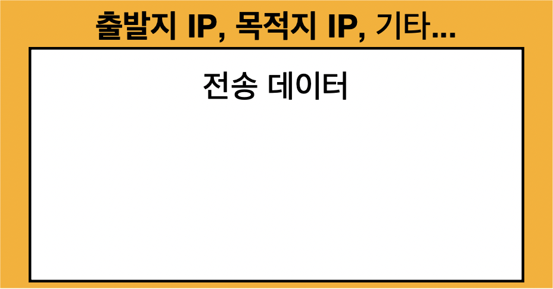
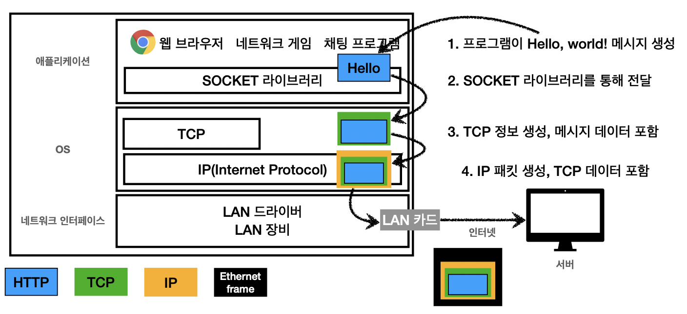
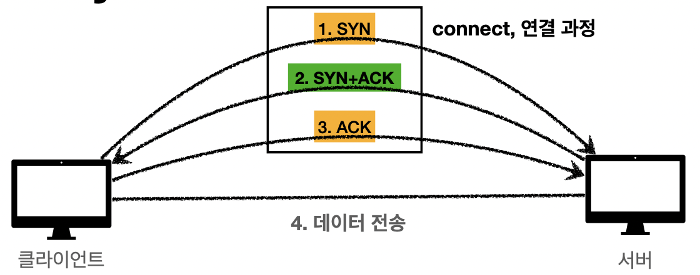
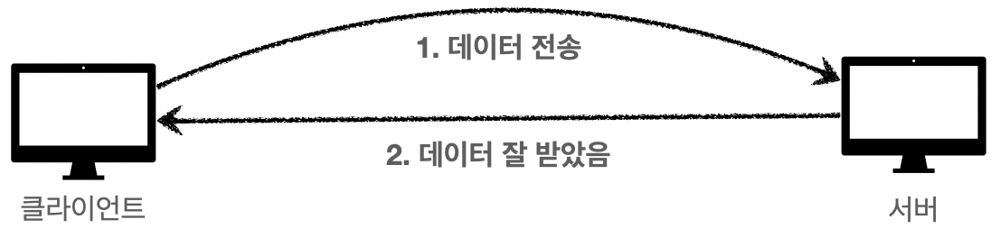
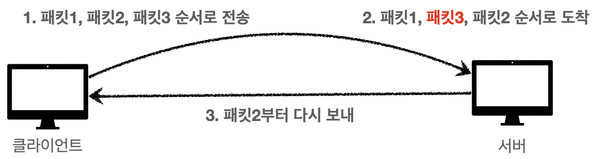

# 1. 인터넷 네트워크

## IP (Internet Protocol)

---

### IP 의 역할

- Packet 이라는 통신 단위로 지정한 IP Address 에 데이터를 전달하는 역할을 가지고 있다.
- Packet 에는 출발지 IP, 목적지 IP, 등이 포함된다.
    
    
    

### IP Protocol 의 한계

- 비연결성 - 패킷을 받을 대상이 없거나, 서비스 불능 상태여도 패킷이 전송된다.
- 비신뢰성 - 중간에 패킷이 사라지거나, 순서가 꼬일 수 있다.
- 프로그램 구분 - 같은 IP 의 어떤 애플리케이션이 요청했는지 구분하지 못한다.

## TCP, UDP

---

### 프로토콜 계층

### TCP (Transmission Control Protocol) 특징

1. 연결지향 - TCP 3 way handshake (가상 연결)
    
    
    
2. 데이터 전달을 보증한다.
    - 메시지를 받지 못했을 경우 데이터가 전달되지 않았다는 사실을 알 수 있다.
    
    
    
3. 패킷의 순서를 보장한다.
    
    
    

### UDP (User Datagram Protocol) 특징

- IP 와 거의 같지만, PORT 와 체크섬 정도만 추가된 상태다.

## PORT

---

- IP - 목적지 서버를 구분한다. (아파트)
- PORT - 같은 IP 내에서 프로세스를 구분한다. (몇동 몇호)
    - 0 ~ 1023: 잘 알려진 포트로 사용하지 않는 것이 좋다.

## DNS (Domain Name System)

---

- 도메인 명을 IP 주소로 변환한다. 일종의 전화번호부