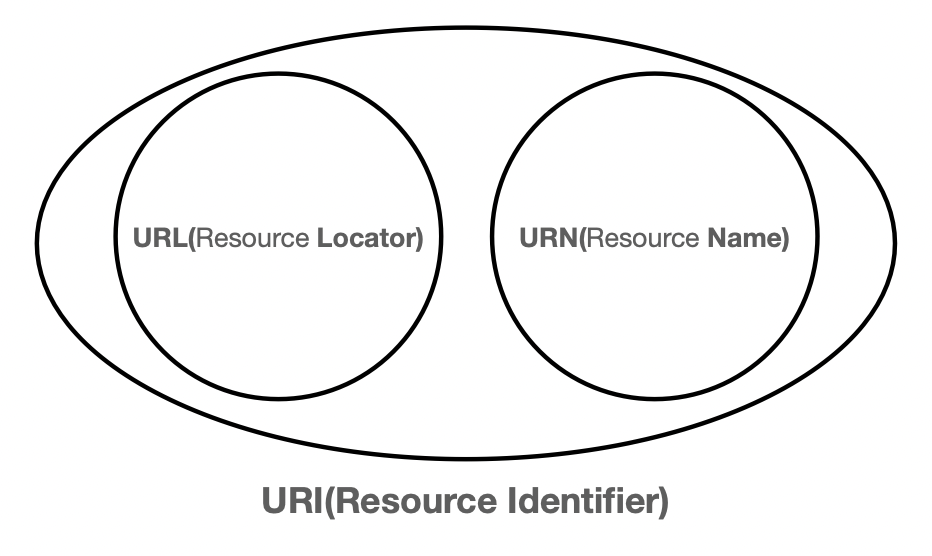
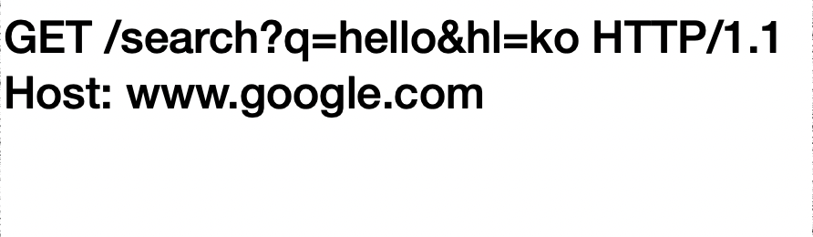
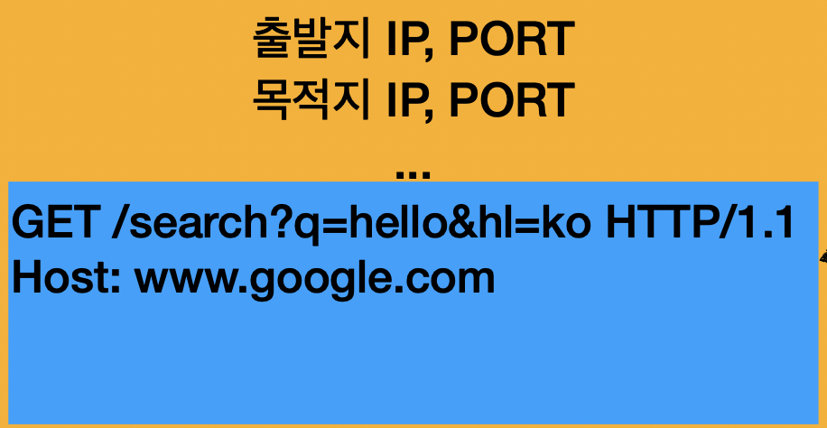
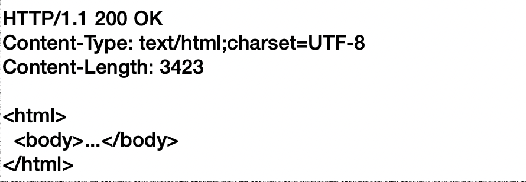

# 2. URI 와 웹 브라우저 요청 흐름

## URI (Uniform Resource Identifier)

---

URI - 리소스 식별자, 자원의 위치를 식별하는 방법이다.

- URL (Locator) - 리소스가 있는 위치를 지정한다.
- URN (Name) - 리소스에 이름을 부여한다.

### URL 구조

> `scheme`://[userinfo@]`host`[:port][`/path`][`?query`][#fragment]
> 
- `scheme` - 프로로콜
- `host` - 호스트명, 도메인명
- `/path` - 리소스 경로
- `?query` - query parameter

## 웹 브라우저 요청 흐름

---

### 1. HTTP 요청 메시지 전송

1. 웹 브라우저가 HTTP 메시지 생성
    
    
    
2. SOCKET 라이브러리를 통해 전달
    1. TCP/IP 연결
    2. 데이터 전달
3. HTTP 메시지 포함한 TCP/IP Packet 생성
    
    
    

### 2. HTTP 응답 메시지 도착

