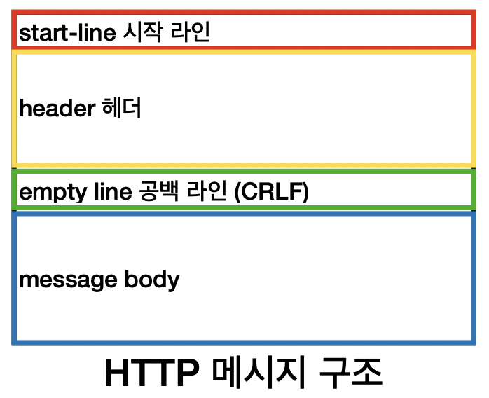
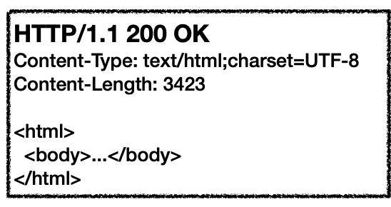

# 3. HTTP 기본

## HTTP 개요

---

- 거의 모든 형태의 데이터를 전송할 수 있다.
- TCP 기반의 HTTP/1.1 이 주로 쓰인다.

## 클라이언트 서버 구조

---

1. 클라이언트가 서버에 요청을 보내고 응답을 기다린다.
2. 서버가 요청에 대한 결과를 만들어 응답한다.

## Stateful, Stateless

---

### 무상태 프로토콜 (Stateless)

- 서버가 클라이언트의 상태를 보존하지 않는다.
    - 장점: 서버 확장성이 높다.
    - 단점: 클라이언트가 추가 데이터를 전송해야 한다.

### Stateful, Stateless 차이

- Stateful - 중간에 서버가 바뀌면 안된다.
- Stateless - 중간에 서버가 바뀌어도 되며, 갑자기 요청이 증가해도 서버를 대거 투입할 수 있다.

### Stateless 실무 한계

- 로그인한 사용자의 경우 로그인 했다는 상태를 서버에서 유지해야 한다.
    - 일반적으로 브라우저 쿠키와 서버 세션등을 사용해서 상태 유지
- 상태 유지는 최소한만 사용

## 비 연결성 (Connectionless)

---

- HTTP 는 기본적으로 연결을 유지하지 않는 모델이다.
    - 요청 → 응답 → 바로 연결 끊음
    - 서버 자원을 매우 효율적으로 사용할 수 있다.

### 한계와 극복

- TCP/IP 연결을 매번 새로 맺어야 하기 때문에 3 way handshake 시간이 추가적으로 발생한다.
- 지금은 HTTP Persistent Connections 로 문제를 해결한다.

## HTTP 메시지

---

### start-line

- request-line (요청 메시지)
    - `method` `request-target` `HTTP-version` 순으로 구성
    - e.g. `GET` `/search?q=hello&hl=ko` `HTTP/1.1`
- status-line (응답 메시지)
    - `HTTP-version` `status-code` `reason-phrase` 순으로 구성
    - e.g. `HTTP/1.1` `200` `OK`

### header

- 요청 메시지
    - e.g. Host: www.google.com
- 응답 메시지
    - e.g. Content-Type: text/html;charset=UTF-8

### message body

- 실제 전송할 데이터