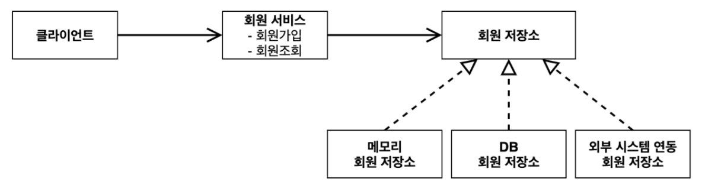
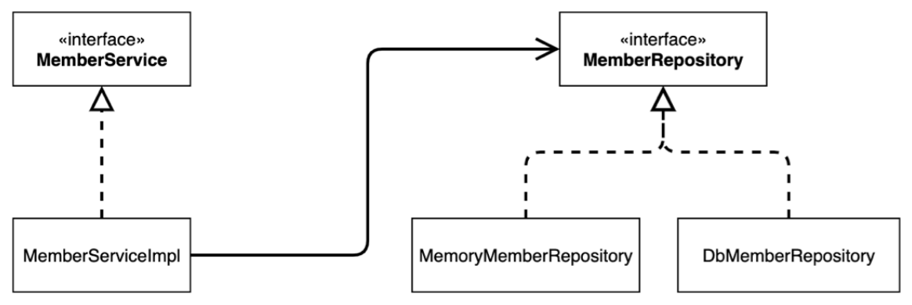
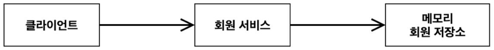
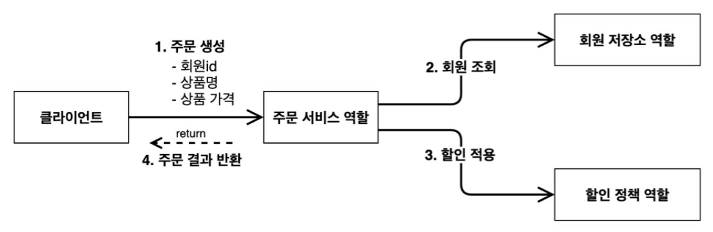
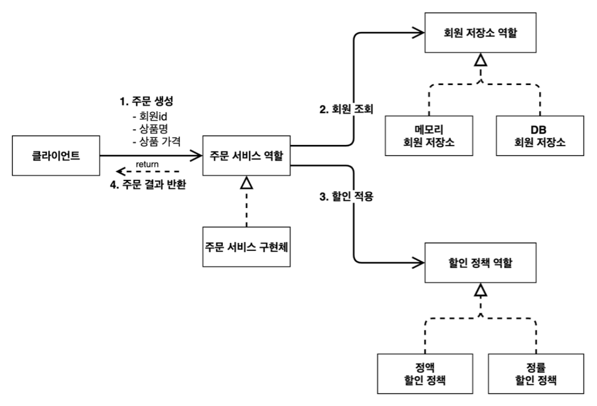
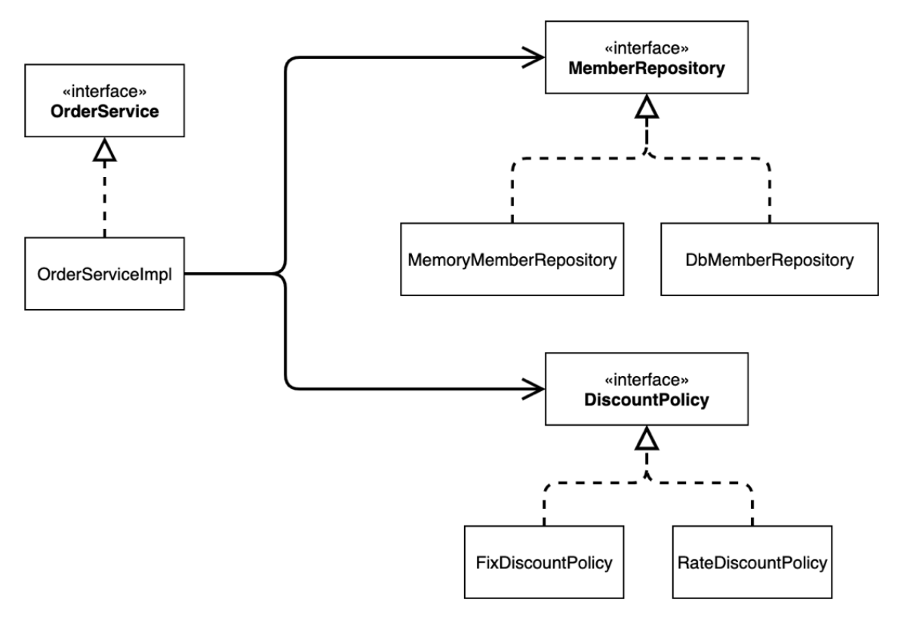
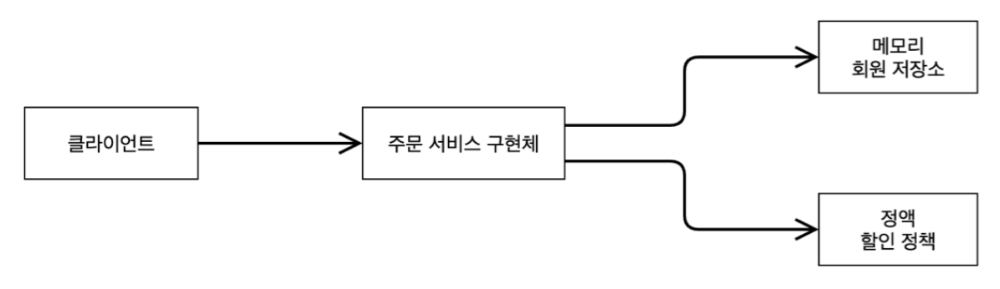
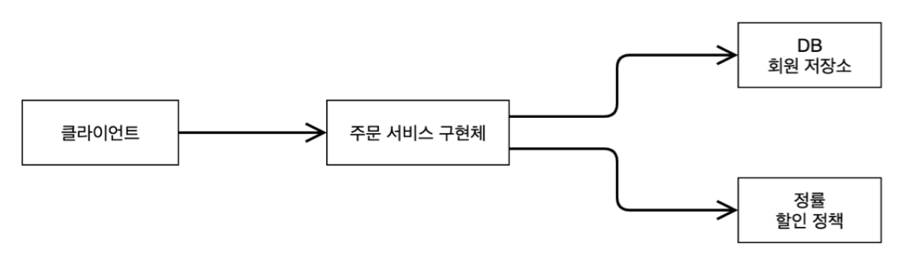

# 2. 스프링 핵심 원리 이해1 - 예제 만들기

## 비즈니스 요구사항과 설계

---

### 회원

- 회원을 가입하고 조회할 수 있다.
- 회원은 일반과 VIP 두 가지 등급이 있다.
- 회원 데이터는 자체 DB 를 구축할 수 있고, 외부 시스템과 연동할 수 있다.

### 주문과 할인 정책

- 회원은 상품을 주문할 수 있다.
- 회원 등급에 따라 할인 정책을 적용할 수 있다.
- 할인 정책은 모든 VIP 는 1000원을 할인해주는 고정 금액 할인을 적용한다.
- 할인 정책은 변경 가능성이 높다. 회사의 기본 할인 정책을 아직 정하지 못했고, 오픈 직전까지 고민을 미루고 싶다. 최악의 경우 할인을 적용하지 않을 수 있다.

## 회원 도메인 설계

---

### 회원 도메인 협력 관계

### 회원 클래스 다이어그램

### 회원 객체 다이어그램

## 주문과 할인 도메인 설계

---

### 주문 도메인 협력, 역할, 책임

### 주문 도메인 전체

### 주문 도메인 클래스 다이어그램

### 주문 도메인 객체 다이어그램

저장소나 할인 정책을 변경해도 서비스 구현체를 변경하지 않아도 된다.