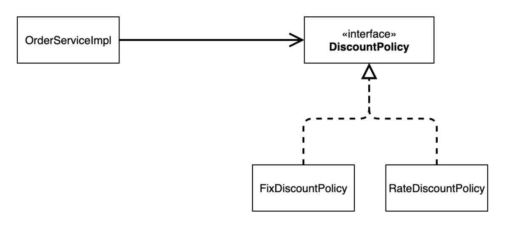
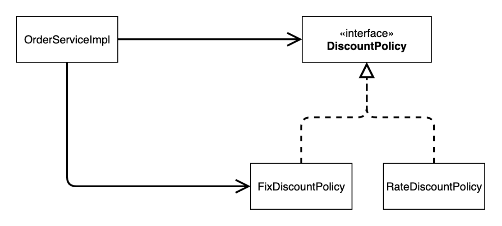
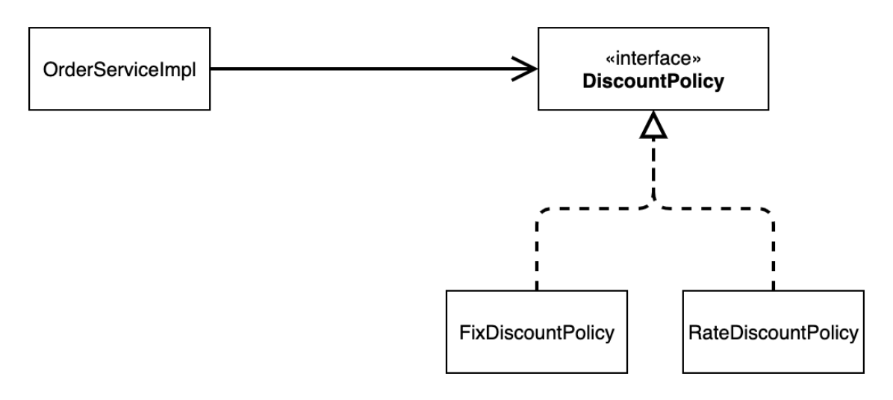
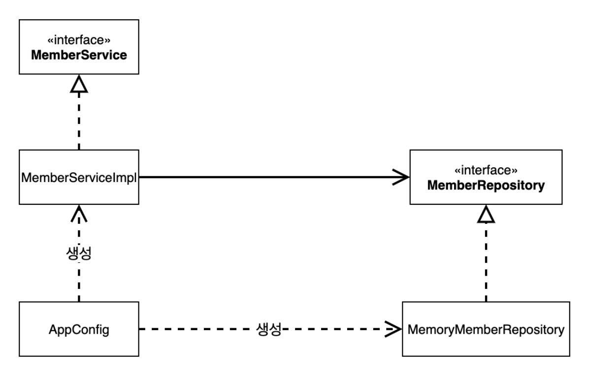
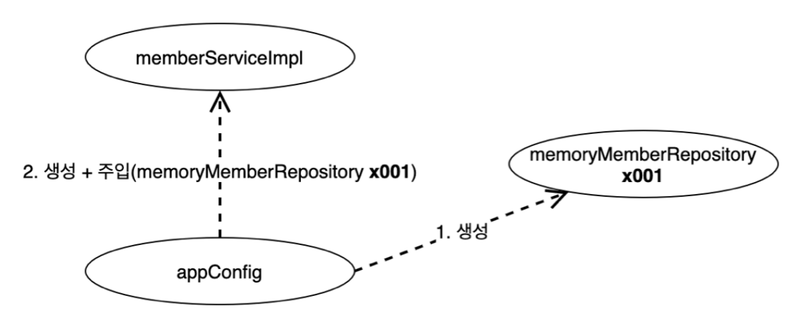
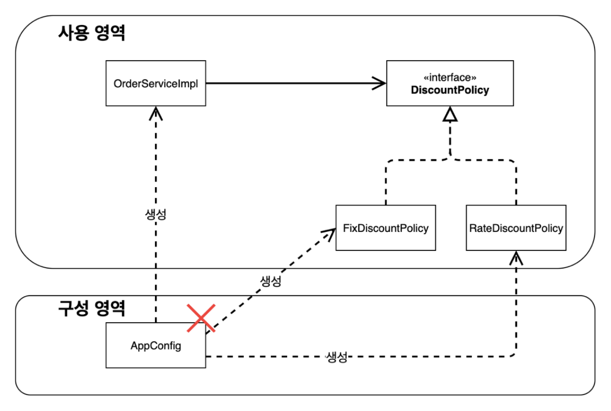

# 3. 스프링 핵심 원리 이해2 - 객체 지향 원리 적용

## 새로운 할인 정책 개발

---

### RateDiscountPolicy 추가



## 새로운 할인 정책 적용과 문제점

---

### 할인 정책을 애플리케이션에 적용해보자

할인 정책을 변경하려면 클라이언트인 `OrderServiceImpl` 코드를 고쳐야 한다.

```java
public class OrderServiceImpl implements OrderService {

    // private final DiscountPolicy discountPolicy = new FixDiscountPolicy();
    private final DiscountPolicy discountPolicy = new RateDiscountPolicy();

    ...
}
```

주문서비스 클라이언트인 `OrderServiceImpl` 는 사실 인터페이스도 의존하면서 구현체에도 의존하고 있다. 따라서 해당 의존관계는 DIP 를 위반하고 있다.

또한, 현재 코드는 기능을 확장해서 변경하면, 클라이언트 코드에 영향을 주기 때문에 OCP 도 위반한다.

### 실제 의존관계



### 인터페이스만 의존하도록 설계 변경



```java
public class OrderServiceImpl implements OrderService {

    private DiscountPolicy discountPolicy;

    ...
}
```

실제 실행해보면 NPE 가 발생한다. 이를 해결하기 위해선 누군가가 클라이언트인 `OrderServiceImpl` 에 `DiscountPolicy` 구현 객체를 대신 생성하고 주입해주어야 한다.

## 관심사의 분리

---

### AppConfig 등장

애플리케이션 전체 동작 방식을 구성(config)하기 위해, **구현 객체를 생성**하고, **연결하는 책임**을 가지는 별도의 설정 클래스, `AppConfig` 를 생성한다. `AppConfig` 는 애플리케이션 동작에 필요한 구현 객체를 생성하고, 생성한 객체를 생성자를 통해 주입한다.

`MemberServiceImpl` 의 생성자를 통해서 어떤 구현 객체를 주입할지는 오직 외부에서 결정되고, `MemberServiceImpl` 은 이제부터 의존관계에 대한 고민은 외부에 맡기고 실행에만 집중한다.

### 클래스 다이어그램



`AppConfig` 를 통해 객체 생성과 연결의 역할을 위임한다. 이를 통해 DIP 를 준수할 수 있게된다.

### 회원 객체 인스턴스 다이어그램



`AppConfig` 를 통해 `MemoryMemberRepository` 를 생성하고 `MemberServiceImpl` 에 주입한다. `MemberServiceImpl` 입장에서는 의존관계가 마치 외부에서 주입되는 것 같아 보이기 때문에 Dependency Injection 의존성 주입이라고 부른다.

## 새로운 구조와 할인 정책 적용

---

### 할인 정책의 변경



`AppConfig` 의 등장으로 애플리케이션이 **사용 영역**과 **객체를 생성하고 구성하는 영역**으로 분리되었다.

할인 정책을 변경해도 `AppConfig` 만 변경하면 되기 때문에, 사용 영역의 어떤 코드도 변경이 없다.

## 좋은 객체 지향 설계의 5가지 원칙의 적용

---

### SRP 단일 책임 원칙

기존 클라이언트 객체는 직접 구현 객체를 생성하고, 연결하고, 실행하는 다양한 책임을 가지고 있었다.

`AppConfig` 를 통해 구현 객체를 생성하고 연결하는 관심사를 분리할 수 있었다.

이를 통해 클라이언트 객체는 실행하는 책임만 담당할 수 있었고, SRP 를 준수할 수 있었다.

### DIP 의존관계 역전 원칙

새로운 할인 정책을 개발하고 적용하려고 하니, 클라이언트 코드도 함께 변경되어야 했다.

`AppConfig` 를 통해 클라이언트 코드가 추상화 인터페이스에만 의존할 수 있도록 변경하고, `AppConfig` 에서 구현체를 생성하여 클라이언트 코드에 의존관계를 주입할 수 있도록 하였다.

이를 통해 DIP 역시 준수할 수 있었다.

### OCP 개방-폐쇄 원칙

다형성을 사용하여 클라이언트가 DIP 를 지켰고, 애플리케이션을 사용 영역과 구성 영역으로 나눴다.

`AppConfig` 를 통해 새로운 구현체를 주입하게 되면, 소프트웨어 요소는 새롭게 확장되었지만, 사용 영역의 변경은 닫혀 있음을 알 수 있다. 이는 결국 OCP 를 준수하는 행위이다.

## IoC, DI, 컨테이너

---

### 제어의 역전 IoC, Inversion of Control

기존 프로그램은 클라이언트 구현 객체가 스스로 필요한 서버 구현 객체를 생성하고, 연결하고, 실행했다.

즉, 구현 객체가 프로그램의 제어 흐름을 스스로 조종했다.

반면, `AppConfig` 의 등장 이후, 구현 객체는 자신의 로직을 실행하는 역할만 담당하고 프로그램의 제어 흐름은 `AppConfig` 가 가져간다.

이렇듯, 프로그램의 제어 흐름을 직접 제어하는 것이 아닌 외부에서 관리하는 것을 제어의 역전이라고 한다.

### 프레임 워크 vs 라이브러리

프레임워크가 내가 작성한 코드를 제어하고 대신 실행하면 그것은 프레임워크다.

반면, 내가 작성한 코드가 직접 제어의 흐름을 담당한다면 그것은 라이브러리인 것이다.

### 의존관계 주입 DI, Dependency Injection

의존관계는 정적인 클래스 의존관계와, 실행 시점에 결정되는 동적인 의존관계를 분리해서 생각해야 한다.

정적인 클래스 의존관계는 클래스가 사용하는 import 코드만 보고도 의존관계를 쉽게 판단할 수 있다.

즉, 애플리케이션을 실행하지 않아도 분석할 수 있다는 의미이다.

동적인 객체 인스턴스 의존관계는 애플리케이션 실행 시점에 실제 생성된 객체 인스턴스의 참조가 연결된 의존관계를 의미한다.

애플리케이션 실행 시점에 외부에서 실제 구현 객체를 생성하고 클라이언트에 전달하여 의존관계가 연결되는 것을 의존성 주입이라고 한다.

의존성 주입을 사용하면 정적인 클래스 의존관계를 변경하지 않고, 동적인 객체 인스턴스 의존관계를 쉽게 변경할 수 있는 것이다.

### IoC 컨테이너와 DI 컨테이너

AppConfig 처럼 객체를 생성하고, 관리하고, 의존관계를 연결해 주는 것을 IoC 컨테이너 혹은 DI 컨테이너라고 한다.

의존관계 주입에 초점을 맞추어 최근에는 주로 DI 컨테이너라고 한다.

## 스프링으로 전환하기

---

### 스프링 컨테이너

`ApplicationContext` 를 스프링 컨테이너라고 한다. 기존에는 `AppConfig` 를 사용해 직접 객체를 생성하고 DI 했지만, 이제부터는 스프링 컨테이너를 통해 사용한다.

```java
@Configuration
public class AppConfig {

    @Bean
    public MemberService memberService() {
        return new MemberServiceImpl(memberRepository());
    }

    @Bean
    public MemberRepository memberRepository() {
        return new MemoryMemberRepository();
    }

    @Bean
    public OrderService orderService() {
        return new OrderServiceImpl(memberRepository(), discountPolicy());
    }

    @Bean
    public DiscountPolicy discountPolicy() {
        return new RateDiscountPolicy();
    }
}
```

스프링 컨테이너는 `@Configuration` 이 붙은 `AppConfig` 를 설정(구성) 정보로 사용한다.

여기서 `@Bean` 이라 적힌 메서드를 모두 호출해서 반환된 객체를 스프링 컨테이너에 등록한다.

스프링 컨테이너에 등록된 객체를 스프링 빈이라고 하며, 메서드명을 스프링 빈의 이름으로 사용한다.

```java
public class OrderApp {

    public static void main(String[] args) {
//        AppConfig appConfig = new AppConfig();
//        MemberService memberService = appConfig.memberService();
//        OrderService orderService = appConfig.orderService();

        ApplicationContext applicationContext = new AnnotationConfigApplicationContext(AppConfig.class);
        MemberService memberService = applicationContext.getBean("memberService", MemberService.class);
        OrderService orderService = applicationContext.getBean("orderService", OrderService.class);

        Long memberId = 1L;
        Member member = new Member(memberId, "memberA", Grade.VIP);
        memberService.join(member);

        Order order = orderService.createOrder(memberId, "itemA", 10000);

        System.out.println("order = " + order);
    }
}
```

기존 `AppConfig` 만을 사용할 때는 필요한 객체를 `AppConfig` 를 사용해 직접 조회했지만, 이제부터는 스프링 컨테이너를 통해서 필요한 스프링 빈을 찾아야 한다.

스프링 빈은 위와 같이 `applicationContext.getBean()` 을 통해 찾을 수 있다.

이로써, 객체를 스프링 빈을 등록하고 스프링 컨테이너에서 스프링 빈을 찾아서 사용할 수 있다.

코드가 더 복잡해진 것 같은데, 굳이 스프링 컨테이너를 사용해야할까? 무슨 장점이 있을까?