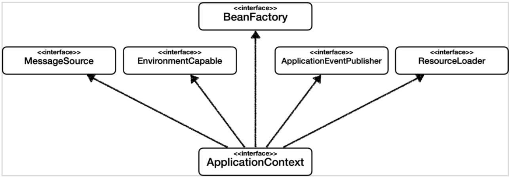
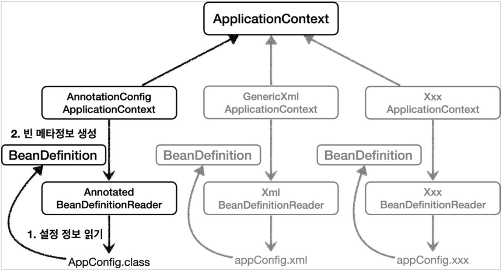

# 4. 스프링 컨테이너와 스프링 빈

## 스프링 컨테이너 생성

---

```java
ApplicationContext applicationContext = new AnnotationConfigApplicationContext(AppConfig.class);
```

- `ApplicationContext` 를 스프링 컨테이너라고 한다.
- `ApplicationContext` 는 인터페이스이다.
- 스프링 컨테이너는 XML 기반으로 만들 수 있고, 어노테이션 기반의 Java 설정 클래스로 만들 수 있다.
- AppConfig 를 사용한 방식이 어노테이션 기반의 Java 설정 클래스로 스프링 컨테이너를 만든 것이다.

## 컨테이너에 등록된 모든 빈 조회

---

```java
@Test
@DisplayName("모든 빈 출력")
void findAllBean() {
    String[] beanDefinitionNames = ac.getBeanDefinitionNames();
    for (String beanDefinitionName : beanDefinitionNames) {
        Object bean = ac.getBean(beanDefinitionName);
        System.out.println("name = " + beanDefinitionName + " object = " + bean);
    }
}

@Test
@DisplayName("애플리케이션 빈 출력")
void findApplicationBean() {
    String[] beanDefinitionNames = ac.getBeanDefinitionNames();
    for (String beanDefinitionName : beanDefinitionNames) {
        BeanDefinition beanDefinition = ac.getBeanDefinition(beanDefinitionName);

        // Role ROLE_APPLICATION: 직접 등록한 애플리케이션 빈
        // Role ROLE_INFRASTRUCTURE: 스프링이 내부에서 사용하는 빈
        if (beanDefinition.getRole() == BeanDefinition.ROLE_APPLICATION) {
            Object bean = ac.getBean(beanDefinitionName);
            System.out.println("name = " + beanDefinitionName + " object = " + bean);
        }
    }
}
```

## 스프링 빈 조회 - 기본

---

- Spring Container 에서 Spring Bean 을 찾는 가장 기본적인 조회 방법
    - `ac.getBean(빈이름, 타입);`
    - `ac.getBean(타입);`
- 조회 대상인 Spring Bean 이 없으면 `NoSuchBeanDefinitionException` 발생

```java
AnnotationConfigApplicationContext ac = new AnnotationConfigApplicationContext(AppConfig.class);

@Test
@DisplayName("빈 이름으로 조회")
void findBeanByName() {
    MemberService memberService = ac.getBean("memberService", MemberService.class);
    assertThat(memberService).isInstanceOf(MemberServiceImpl.class);
}

@Test
@DisplayName("빈 타입으로 조회")
void findBeanByType() {
    MemberService memberService = ac.getBean(MemberService.class);
    assertThat(memberService).isInstanceOf(MemberServiceImpl.class);
}

@Test
@DisplayName("구체 타입으로 조회")
void findBeanByExactType() {
    MemberServiceImpl memberService = ac.getBean("memberService", MemberServiceImpl.class);
    assertThat(memberService).isInstanceOf(MemberServiceImpl.class);
}

@Test
@DisplayName("없는 빈 이름으로 조회")
void findNotExistingBeanByName() {
    assertThatThrownBy(() -> ac.getBean("xxxx", MemberService.class))
            .isInstanceOf(NoSuchBeanDefinitionException.class);
}
```

## 스프링 빈 조회 - 동일한 타입이 둘 이상

---

- 타입으로 조회 시 같은 타입의 스프링 빈이 둘 이상이면 오류가 발생한다. 이때는 빈 이름을 지정.
- `ac.getBeansOfType()` 을 사용하면 해당 타입의 모든 빈을 조회할 수 있다.

```java
public class ApplicationContextSameBeanFindTest {

    AnnotationConfigApplicationContext ac = new AnnotationConfigApplicationContext(SameBeanConfig.class);

    @Test
    @DisplayName("타입으로 조회 시 동일한 타입이 둘 이상 있으면 예외 발생")
    void findBeanByTypeDuplicate() {
        assertThatThrownBy(() -> ac.getBean(MemberRepository.class))
                .isInstanceOf(NoUniqueBeanDefinitionException.class);
    }

    @Test
    @DisplayName("타입으로 조회 시 동일한 타입이 둘 이상 있으면 빈 이름 지정")
    void findBeanByName() {
        MemberRepository memberRepository = ac.getBean("memberRepository", MemberRepository.class);
        assertThat(memberRepository).isInstanceOf(MemberRepository.class);
    }

    @Test
    @DisplayName("특정 타입 모두 조회하기")
    void findAllBeanByType() {
        Map<String, MemberRepository> beansOfType = ac.getBeansOfType(MemberRepository.class);
        for (String key : beansOfType.keySet()) {
            System.out.println("key = " + key + " value = " + beansOfType.get(key));
        }
        System.out.println("beansOfType = " + beansOfType);
        assertThat(beansOfType.size()).isEqualTo(2);
    }

    @Configuration
    static class SameBeanConfig {

        @Bean
        public MemberRepository memberRepository() {
            return new MemoryMemberRepository();
        }

        @Bean
        public MemberRepository memberRepository2() {
            return new MemoryMemberRepository();
        }
    }
}
```

## 스프링 빈 조회 - 상속 관계

---

- 부모 타입으로 조회하면, 자식 타입도 함께 조회한다.
- 그래서 모든 자바 객체의 최고 부모인 `Object` 타입으로 조회하면 모든 스프링 빈을 조회한다.

```java
public class ApplicationContextExtendsFindTest {

    AnnotationConfigApplicationContext ac = new AnnotationConfigApplicationContext(TestConfig.class);

    @Test
    @DisplayName("부모 타입으로 조회 시 자식이 둘 이상 있으면 예외 발생")
    void findBeanByParentTypeDuplicate() {
        assertThatThrownBy(() -> ac.getBean(DiscountPolicy.class))
                .isInstanceOf(NoUniqueBeanDefinitionException.class);
    }

    @Test
    @DisplayName("부모 타입으로 조회 시 자식이 둘 이상 있으면 빈 이름 지정")
    void findBeanByParentTypeBeanName() {
        DiscountPolicy rateDiscountPolicy = ac.getBean("rateDiscountPolicy", DiscountPolicy.class);
        assertThat(rateDiscountPolicy).isInstanceOf(RateDiscountPolicy.class);
    }

    @Test
    @DisplayName("특정 하위 타입으로 조회")
    void findBeanBySubType() {
        DiscountPolicy rateDiscountPolicy = ac.getBean(RateDiscountPolicy.class);
        assertThat(rateDiscountPolicy).isInstanceOf(RateDiscountPolicy.class);
    }

    @Test
    @DisplayName("부모 타입으로 모두 조회")
    void findAllByParentType() {
        Map<String, DiscountPolicy> beansOfType = ac.getBeansOfType(DiscountPolicy.class);
        assertThat(beansOfType.size()).isEqualTo(2);
    }

    @Test
    @DisplayName("부모 타입으로 모두 조회 - Object")
    void findAllByObjectType() {
        Map<String, Object> beansOfType = ac.getBeansOfType(Object.class);
    }

    @Configuration
    static class TestConfig {

        @Bean
        public DiscountPolicy rateDiscountPolicy() {
            return new RateDiscountPolicy();
        }

        @Bean
        public DiscountPolicy fixDiscountPolicy() {
            return new FixDiscountPolicy();
        }
    }
}
```

## BeanFactory 와 ApplicationContext

---

### BeanFactory

- 스프링 컨테이너의 최상위 인터페이스
- 스프링 빈을 관리하고 조회하는 역할을 담당
- `getBean()` 을 제공

### ApplicationContext

- `BeanFactory` 의 기능을 모두 상속받아서 제공
- 애플리케이션 개발할 때는 `BeanFactory` 에서 제공하는 기능 외에도 많은 부가기능이 필요

### ApplicationContext 가 제공하는 부가기능



- 메시지소스를 활용한 국제화 기능
    - 한국에서 들어오면 한국어, 영어권에서 들어오면 영어로 출력
- 환경변수
    - 로컬, 개발, 운영등을 구분해서 처리
- 애플리케이션 이벤트
    - 이벤트를 발행하고 구독하는 모델을 편리하게 지원
- 편리한 리소스 조회
    - 파일, 클래스패스, 외부 등에서 리소스를 편리하게 조회

### 정리

- ApplicationContext 는 BeanFactory 의 기능을 상속받는다.
- ApplicationContext 는 빈 관리 기능 + 편리한 부가 기능을 제공한다.
- BeanFactory 를 직접 사용할 일은 거의 없고, ApplicationContext 를 사용한다.
- BeanFactory 나 ApplicationContext 를 모두 스프링 컨테이너라고 한다.

## 스프링 빈 설정 메타 정보 - BeanDefinition

---

- 스프링은 어떻게 이런 다양한 설정 형식을 지원하는가?
- 그 중심에는 BeanDefinition 이라는 추상화가 있다.
    - XML, 자바 코드 등이 BeanDefinition 으로 만들어지면 스프링 컨테이너는 BeanDefinition 만 알면된다.
- `BeanDefinition` 을 메타정보라 한다.
    - `@Bean` `<bean>` 당 각각 하나씩 메타 정보가 생성된다.
- 스프링 컨테이너는 이 메타정보를 기반으로 스프링 빈을 생성한다.



- `AnnotationConfigApplicationContext` 는 `AnnotatedBeanDefinitionReader` 를 사용해서 `AppConfig.class` 를 읽고 `BeanDefinition` 을 생성한다.

### BeanDefinition

- `BeanClassName`
- `factoryBeanName`
- `factoryMethodName`
- `Scope`
- `lazyInit`
- `InitMethodName`
- `DestroyMethodName`
- `Constructor arguments, Properties`

### 정리

- BeanDefinition 을 직접 생성해서 스프링 컨테이너에 등록할 수 도 있다.
- 하지만 실무에서 BeanDefinition 을 직접 정의하거나 사용할 일은 거의 없다.
- BeanDefinition 에 대해서 너무 깊이있게 이해하기 보단, 스프링이 다양한 형태의 설정 정보를 BeanDefinition 으로 추상화해서 사용한다는 것 정도만 이해하면 된다.
- 가끔 스프링 코드나 스프링 관련 오픈 소스의 코드를 볼 때, BeanDefinition 이라는 것이 보일 때가 있는데, 이때 이런 메커니즘을 떠올리면 된다.