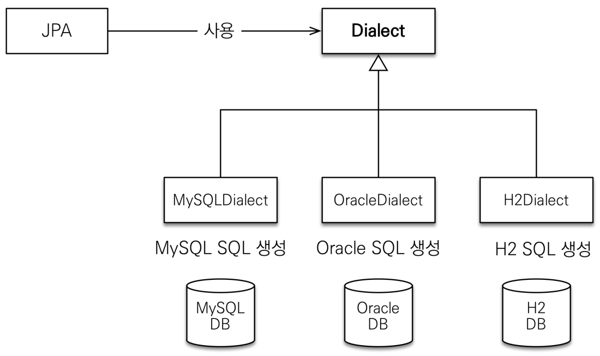
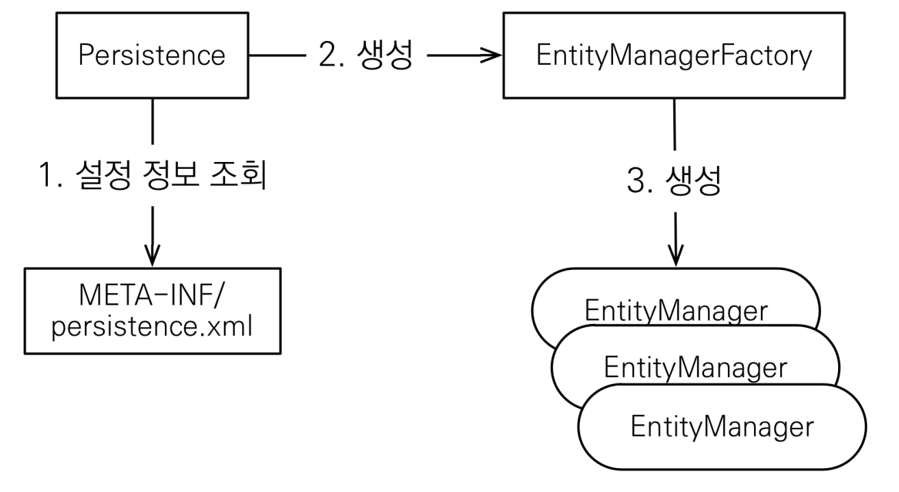

# 2. JPA 시작하기

## **Hello JPA - 프로젝트 생성**

---

### `pom.xml` 라이브러리 추가

```xml
<?xml version="1.0" encoding="UTF-8"?>
<project xmlns="http://maven.apache.org/POM/4.0.0"
         xmlns:xsi="http://www.w3.org/2001/XMLSchema-instance"
         xsi:schemaLocation="http://maven.apache.org/POM/4.0.0 http://maven.apache.org/xsd/maven-4.0.0.xsd">
    <modelVersion>4.0.0</modelVersion>

    <groupId>jpa-basic</groupId>
    <artifactId>ex1-hello-jpa</artifactId>
    <version>1.0.0</version>

    <dependencies>
        <!-- JPA 하이버네이트 -->
        <dependency>
            <groupId>org.hibernate</groupId>
            <artifactId>hibernate-entitymanager</artifactId>
            <version>5.3.10.Final</version>
        </dependency>

        <!-- H2 데이터베이스 -->
        <dependency>
            <groupId>com.h2database</groupId>
            <artifactId>h2</artifactId>
            <version>2.1.214</version>
        </dependency>

        <dependency>
            <groupId>javax.xml.bind</groupId>
            <artifactId>jaxb-api</artifactId>
            <version>2.3.1</version>
        </dependency>
    </dependencies>
    <properties>
        <maven.compiler.source>11</maven.compiler.source>
        <maven.compiler.target>11</maven.compiler.target>
    </properties>
</project>
```

### `persistence.xml` JPA 설정하기

```xml
<?xml version="1.0" encoding="UTF-8"?>
<persistence version="2.2"
             xmlns="http://xmlns.jcp.org/xml/ns/persistence" xmlns:xsi="http://www.w3.org/2001/XMLSchema-instance"
             xsi:schemaLocation="http://xmlns.jcp.org/xml/ns/persistence http://xmlns.jcp.org/xml/ns/persistence/persistence_2_2.xsd">

    <persistence-unit name="hello">
        <properties>
            <!-- 필수 속성 -->
            <property name="javax.persistence.jdbc.driver" value="org.h2.Driver"/>
            <property name="javax.persistence.jdbc.user" value="sa"/>
            <property name="javax.persistence.jdbc.password" value=""/>
            <property name="javax.persistence.jdbc.url" value="jdbc:h2:tcp://localhost/~/test"/>
            <property name="hibernate.dialect" value="org.hibernate.dialect.H2Dialect"/>

            <!-- 옵션 -->
            <property name="hibernate.show_sql" value="true"/>
            <property name="hibernate.format_sql" value="true"/>
            <property name="hibernate.use_sql_comments" value="true"/>
            <!--<property name="hibernate.hbm2ddl.auto" value="create" />-->
        </properties>
    </persistence-unit>
</persistence>
```

### 데이터베이스 방언



JPA 는 특정 데이터베이스에 종속적이지 않다.

각각의 데이터베이스가 제공하는 SQL 문법과 함수는 조금씩 다르다.

예를 들어, MySQL 은 VARCHAR, Oracle 은 VARCHAR2 를 사용한다.

즉, 방언은 SQL 표준을 지키지 않는 특정 데이터베이스만의 고유한 기능을 의미한다.

JPA 에서는 `hibernate.dialect` 속성에 지정하여 특정 데이터베이스 방언을 설정할 수 있다.

- H2 : org.hibernate.dialect.H2Dialect
- Oracle 10g : org.hibernate.dialect.Oracle10gDialect
- MySQL : org.hibernate.dialect.MySQL5InnoDBDialect

## **Hello JPA - 애플리케이션 개발**

---

### JPA 구동 방식



`Persistence` 라는 클래스에서 설정 파일인 `persistence.xml` 을 읽어서 `EntityManagerFactory` 를 생성한다. 이후 `EntityManagerFactory` 에서 EntityManager 를 찍어내서 사용한다.

### 객체와 테이블을 생성하고 매핑해보자

```java
package hellojpa;

import javax.persistence.Entity;
import javax.persistence.Id;

@Entity // JPA 가 관리할 객체를 의미한다.
public class Member {

    @Id // 데이터베이스의 PK 와 매핑한다.
    private Long id;
    private String name;

    // Getter, Setter …
}
```

```sql
create table Member (
    id   bigint not null,
    name varchar(255),
    primary key (id)
);
```

### 회원 등록하기

```java
public static void main(String[] args) {
    // persistence.xml 에 있는 persistence-unit name 값을 넣어준다.
    EntityManagerFactory emf = Persistence.createEntityManagerFactory("hello");

    EntityManager em = emf.createEntityManager();

    EntityTransaction tx = em.getTransaction();
    tx.begin();

    // code 작성
    try {
        // 영속
        Member member = em.find(Member.class, 150L);
        member.setName("ZZZZZ");

        tx.commit();
    } catch (Exception e) {
        tx.rollback();
    } finally {
        em.close();
    }

    emf.close();
}
```

### 주의

- 엔티티 매니저 팩토리는 하나만 생성해서 애플리케이션 전체에서 공유한다.
- 엔티티 매니저는 쓰레드간 공유되지 않기 때문에 사용하고 버려야 한다.
- JPA 의 모든 데이터 변경은 트랜잭션 안에서 실행된다.

### JPQL

JPA 를 사용하면 엔티티 객체를 중심으로 개발을 진행하게 된다.

특정 엔티티 검색 시에 `em.find()` 로 단순히 조회하거나 `a.getB().getC()` 와 같이 객체 그래프 탐색을 통해 조회를 수행할 수 있다.

문제는 조건이 포함된 검색 쿼리를 전송할 때 발생한다.

조건이 포함된 검색을 할 때도 테이블이 아닌 엔티티 객체를 대상으로 검색하기 때문에 모든 DB 데이터를 객체로 변환해서 검색하는 것은 비효율적이다.

애플리케이션이 필요한 데이터만 DB 에서 불러오려면 결국 검색 조건이 포함된 SQL 이 필요하다.

즉, DB 에 종속적으로 설계가 될 수 밖에 없다는 의미다.

이를 해결하기 위해 JPA 는 SQL 을 추상화한 JPQL 이라는 객체 지향 쿼리 언어 제공한다.

SQL 이 DB 의 테이블을 대상으로 쿼리를 날린다면, JPQL 은 엔티티 객체를 대상으로 쿼리를 날린다.

JPQL 은 테이블이 아닌 객체를 대상으로 하는 객체 지향 쿼리이기 때문에 방언 설정에 맞춰서 각 DB 에 맞게 번역하여 쿼리를 전송한다.

이는 JPQL 이 SQL 을 추상화하기 때문에 특정 데이터베이스 SQL 에 의존하지 않는다는 의미이기도 하다.