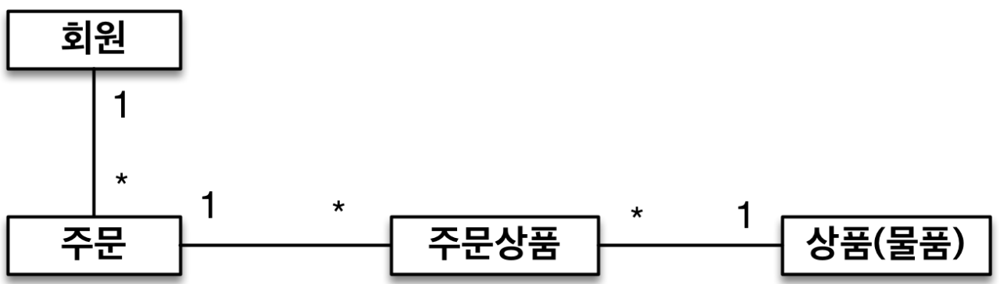

# 4. 엔티티 매핑

## 객체와 테이블 매핑

---

### JPA 에서 제일 중요한 2가지

1. 영속성 컨텍스트 및 내부 동작 방식
2. 객체와 엔티티의 매핑 설계

### 엔티티 매핑 소개

JPA 는 객체와 엔티티를 매핑하기 위해 아래와 같은 다양한 애너테이션을 지원한다.

- `@Entity` `@Table` 객체와 테이블 매핑을 위한 애너테이션
- `@Column` 필드와 컬럼 매핑을 위한 애너테이션
- `@Id` 기본 키 매핑을 위한 애너테이션
- `@ManyToOne` `@JoinColumn` 연관관계 매핑을 위한 애너테이션

이번 강의에서는 연관관계 매핑을 제외한 모든 애너테이션을 다뤄볼 것이다.

### @Entity

`@Entity` 가 붙은 클래스는 JPA 가 관리한다.

때문에, JPA 를 사용해서 테이블과 매핑할 클래스는 `@Entity` 가 필수적이다.

`@Entity` 사용 시 주의할 점이 몇가지 있는데, 이는 아래와 같다.

- 동적 생성을 위한 `public` 또는 `protected` 기본 생성자가 필수적이다.
- final 클래스, enum, interface, inner 클래스는 사용하지 않는다.
- 저장할 필드에 `final` 을 사용하지 않는다.

`name` 속성을 통해 `@Entity(name = "Member")` 처럼 사용할 엔티티의 이름을 지정할 수 있다.

- 기본값으로 클래스 이름을 사용한다.
- 다른 패키지에 이름이 같은 클래스가 없으면 가급적 기본값을 사용한다.

### @Table

`@Table` 은 엔티티와 매핑할 테이블 지정하는 애너테이션이다.

`@Table` 애너테이션에는 다양한 속성이 존재하는데, 이는 아래와 같다.

- `name` 속성으로 DB 테이블 이름이 MBR 일 경우 `@Table(name = "MBR")` 로 지정할 수 있다.
- `calalog` 속성으로 데이터베이스 catalog 매핑할 수 있다.
- `schema` 속성으로 데이터베이스 schema 매핑할 수 있다.
- `uniqueConstraints` 속성으로 DDL 생성 시 유니크 제약 조건을 생성할 수 있다.

## 데이터베이스 스키마 자동 생성

---

JPA 는 매핑 정보만 보고 무슨 테이블이 필요한지 알기 때문에 DDL 을 애플리케이션 실행 시점에 자동 생성하여 테이블을 자동으로 생성해준다.

이는 여러가지 장점을 제공하는데, 이는 아래와 같다.

- 테이블 중심 개발에서 객체 중심 개발로 전환할 수 있다.
- DB 방언을 활용해서 DB 에 맞는 적절한 DDL 을 생성한다.

이런 자동 생성 DDL 은 운영 서버에서는 불안할 수 있기 때문에 아래와 같은 주의 사항이 존재한다.

- 이렇게 생성된 DDL 은 개발 장비에서만 사용해야 한다.
- 생성된 DDL 은 운영서버에서는 사용하지 않거나, 적절히 다듬은 후 사용할 수 있다.

### 데이터베이스 스키마 자동 생성 - 속성 설정

JPA 설정 시 `hibernate.hbm2ddl.auto` 설정이 존재하는데, 아래와 같은 기능들을 제공한다.

- `create` 기존 테이블을 DROP 한 후 다시 CREATE 한다.
- `create-drop` create 와 같으나 종료 시점에 테이블을 DROP 한다.
- `update` 변경문만 반영한다. 때문에 운영 DB 에서는 사용해선 안된다.
- `validate` 엔티티와 테이블이 정상 매핑되었는지만 확인한다.
- `none` 아무 설정도 사용하지 않는다.

### 데이터베이스 스키마 자동 생성 - 주의

운영 장비에는 절대로 `create` `create-drop` `update` 는 사용하면 안된다.

- 개발 초기 단계에는 `create` 또는 `update` 를 사용한다.
- 테스트 서버에서는 `update` 또는 `validate` 를 사용한다.
- 스테이징과 운영 서버에서는 `validate` 또는 `none` 을 사용한다.

### DDL 생성 기능

DDL 생성 기능은 DDL 을 자동으로 생성할 때만 사용될 뿐, JPA 의 실행 로직에는 영향을 주지 않는다.

- 제약조건 추가
    - `@Column(nullable = false, length = 10)`
- 유니크 제약조건 추가
    - `@Table(uniqueConstraints = {@UniqueConstraint( name = "NAME_AGE_UNIQUE", columnNames = {"NAME", "AGE"} )})`

## 필드와 컬럼 매핑

---

```java
@Entity
public class Member {

    @Id // PK 매핑
    private Long id;

    @Column(name = "name") // 컬럼 이름 설정
    private String userName;

    private Integer age;

    @Enumerated(EnumType.STRING) // enum 타입 사용 시
    private RoleType roleType;

    @Temporal(TemporalType.TIMESTAMP) // 날짜 타입 사용 시
    private Date createdDate;

    @Temporal(TemporalType.TIMESTAMP)
    private Date lastModifiedDate;

    @Lob
    private String description;

    public Member() {
    }
}
```

```java
create table Member (
   id bigint not null,
    age integer,
    createdDate timestamp,
    description clob,
    lastModifiedDate timestamp,
    roleType varchar(255),
    name varchar(255),
    primary key (id)
)
```

### 매핑 애너테이션 정리

- `@Column` 컬럼 매핑
- `@Temporal` 날짜 매핑
- `@Enumerated` enum 타입 매핑
- `@Lob` BLOB, CLOB 매핑
- `@Transient` 특정 필드를 컬럼에 매핑하지 않음

### @Column 속성

- `name` 필드와 매핑할 테이블의 컬럼 이름
    - 기본값은 객체의 필드 이름으로 지정됨
- `insertable` `updatable` 등록, 변경 가능 여부
    - 기본값은 TRUE 로 지정됨
- `nullable(DDL)` null 값의 허용 여부 설정한다. false 로 설정 시 not null 제약조건이 추가된다.
- `unique(DDL)` 한 컬럼에 간단히 유니크 제약조건 추가 시 사용
    - 이름을 설정하기 위해 `@Table(uniqueConstraints)` 더 많이 사용함
- `columnDefinition(DDL)` DB 컬럼 정보를 직접 줄 수 있음
- `length(DDL)` 문자 길이 제약조건. String 타입에만 사용
    - 기본값은 255 로 지정됨
- `precision` `scale(DDL)` BigDecimal 타입에서 사용
    - `precision` 은 소수점 포함 전체 자릿수. 기본값 = 19
    - `scale` 은 소수의 자릿수. 기본값 = 2

### @Enumarated 속성

자바 enum 타입을 매핑할 때 사용하는데, ORDINAL 은 사용하지 않는다.

ORDINAL 은 순서로 저장하기 때문에 enum 이 추가될 경우 같은 값을 보장할 수 없다.

- `@Enumerated(EnumType.ORDINAL)` enum 순서를 DB 에 저장
- `@Enumerated(EnumType.STRING)` enum 이름을 DB 에 저장

### @Temporal 속성

날짜 타입을 매핑할 때 사용한다.

최신 하이버네이트에서는 LocalDate, LocalDateTime 을 지원하기 때문에 생략 가능하다.

- `@Temporal(TemporalType.DATE)` 날짜, DB 의 date 타입과 매핑
- `@Temporal(TemporalType.TIME)` 시간, DB 의 time 타입과 매핑
- `@Temporal(TemporalType.TIMESTAMP)` 날짜와 시간, DB 의 timestamp 타입과 매핑

### @Lob 속성

DB 의 BLOC 과 CLOB 타입과 매핑할 때 사용한다.

매핑하는 필드 타입이 문자면 CLOB 매핑, 나머지는 BLOB 매핑된다.

- CLOB - `String` `char[]` `java.sql.CLOB`
- BLOB - `byte[]` `java.sql.BLOB`

## 기본 키 매핑

---

### 기본 키 매핑 방법

- `@Id` 만 사용하여 직접 할당
- `@Id @GeneratedValue` 를 통한 자동 생성
    - `IDENTITY` DB 에 위임, MySQL 에서 사용한다.
    - `SEQUENCE` DB 시퀀스 오브젝트 사용, ORACLE 에서 사용한다.
        - `@SequenceGenerator` 필요
    - `TABLE` 키 생성용 테이블 사용, 모든 DB 에서 사용한다.
        - `@TableGenerator` 필요
    - `AUTO` 방언에 따라 자동 지정, 기본값으로 설정된다.

### IDENTITY 전략

```java
@Entity
public class Member {

    @Id
    @GeneratedValue(strategy = GenerationType.IDENTITY)
    private Long id;
}
```

기본 키 생성을 DB 에 위임하는 것이다. 주로 MySQL 의 AUTO_INCREMENT 에 사용된다.

JPA 는 보통 트랜잭션 커밋 시점에 INSERT SQL 을 실행한다.

하지만, AUTO_ INCREMENT 는 데이터베이스에 INSERT SQL 을 실행한 이후에 ID 값을 알 수 있다.

때문에, IDENTITY 전략은 `em.persist()` 시점에 즉시 INSERT SQL 실행하고 DB에서 식별자를 조회한다.

### SEQUENCE 전략

```java
@Entity
@SequenceGenerator(
    name = “MEMBER_SEQ_GENERATOR",
    sequenceName = “MEMBER_SEQ", //매핑할 데이터베이스 시퀀스 이름
    initialValue = 1, allocationSize = 1)
public class Member {

    @Id
    @GeneratedValue(strategy = GenerationType.SEQUENCE,
                    generator = "MEMBER_SEQ_GENERATOR")
    private Long id;
}
```

DB 시퀀스는 유일한 값을 순서대로 생성하는 특별한 DB 오브젝트이다. 주로 ORACLE 에서 사용한다.

SEQUENCE 전략은 `allocationSize` 속성을 통해 메모리에 숫자를 미리 가져와서 사용한다.

즉, 50으로 설정해두면, 1 ~ 50 까지는 메모리를 통해 id 값을 할당하기 때문에 DB 와 네트워크 통신이 일어나지 않는다.

### TABLE 전략

```sql
create table MY_SEQUENCES (
    sequence_name varchar(255) not null,
    next_val bigint,
    primary key ( sequence_name )
)
```

```java
@Entity
@TableGenerator(
    name = "MEMBER_SEQ_GENERATOR",
    table = "MY_SEQUENCES",
    pkColumnValue = “MEMBER_SEQ", allocationSize = 1)
public class Member {

    @Id
    @GeneratedValue(strategy = GenerationType.TABLE,
                    generator = "MEMBER_SEQ_GENERATOR")
    private Long id;
}
```

키 생성 전용 테이블을 하나 만들어서 DB 시퀀스를 흉내내는 전략이다.

모든 DB 에 적용 가능하지만, 성능이 좋지 않기 때문에 잘 사용하지 않는다.

### 권장하는 식별자 전략

가장 좋은 기본 키 제약 조건은 null 이 아니며 유일하고 변하면 안된다.

미래까지 이 조건을 만족하는 자연키는 찾기 어렵기 때문에 대체키를 사용한다.

예를 들어, 주민등록번호도 기본 키로 적절하지 않다.

때문에, Long형 + 대체키 + 키 생성전략 사용하는 것을 권장한다.

## 실전 예제 1 - 요구사항 분석과 기본 매핑

---

### 요구사항 분석

- 회원은 상품을 주문할 수 있다.
- 주문 시 여러 종류의 상품을 선택할 수 있다.

### 기능 목록

- 회원 기능
    - 회원 등록
    - 회원 조회
- 상품 기능
    - 상품 등록
    - 상품 수정
    - 상품 조회
- 주문 기능
    - 상품 주문
    - 주문 내역 조회
    - 주문 취소

### 도메인 모델 분석



- 회원과 주문의 관계: 회원은 여러 번 주문할 수 있다. (일대다)
- 주문과 상품의 관계: 주문할 때 여러 상품을 선택할 수 있다. 반대로 같은 상품도 여러 번 주문될 수 있다. 주문 상품이라는 모델을 만들어 다대다 관계를 일대다, 다대일 관계로 풀어냄.

### 테이블 설계


### 엔티티 설계와 매핑


### 데이터 중심 설계의 문제점

현재 방식은 테이블의 외래키를 객체에 그대로 가져와 사용한다.

즉, 테이블 설계에 맞춰진 객체를 사용하고 있는 것이다.

이러한 설계는 객체 그래프 탐색이 불가능하며, 참조가 없기 때문에 UML 도 잘못된 것을 알 수 있다.