# 6. 다양항 연관관계 매핑

## 연관관계 매핑 시 고려사항 3가지

---

### 다중성

- `@ManyToOne` 다대일
- `@OneToMany` 일대다
- `@OneToOne` 일대일
- `@ManyToMany` 다대다

### 단방향, 양방향

테이블

- 외래 키 하나로 양쪽 조인 가능
- 사실 방향이라는 개념이 없음

객체

- 참조용 필드가 있는 쪽으로만 참조 가능
- 한쪽만 참조하면 단방향
- 양쪽이 서로 참조하면 양방향

### 연관관계 주인

- 테이블은 외래 키 하나로 두 테이블이 연관관계를 맺음
- 객체 양방향 관계는 참조가 2군데 있음
- 둘 중 테이블의 외래 키를 관리할 곳을 지정해야 함
- 즉, 연관관계의 주인은 외래키를 관리하는 참조이고, 주인의 반대편은 단순 조회만 가능

## 다대일 [N:1]

---

### 다대일 단방향

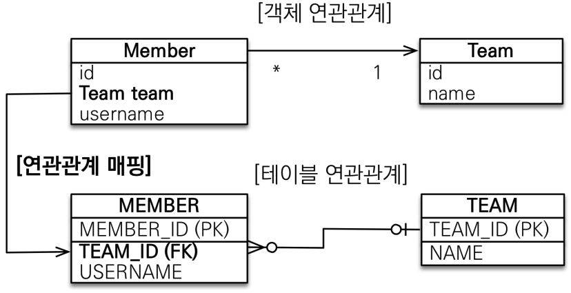

- 가장 많이 사용하는 연관관계
- 다대일의 반대는 일대다

### 다대일 양방향

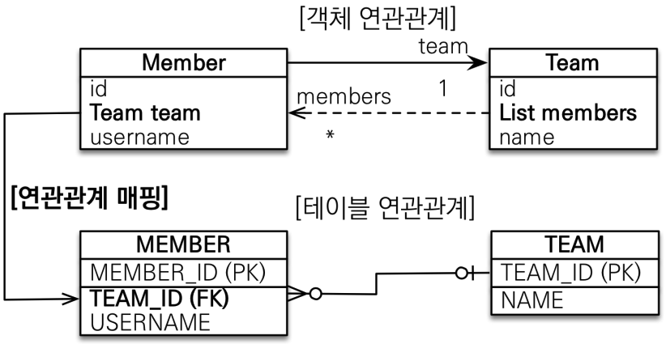

- 외래 키가 있는 쪽이 연관관계의 주인
- 양쪽을 서로 참조하도록 개발

## 일대다 [1:N]

---

### 일대다 단방향

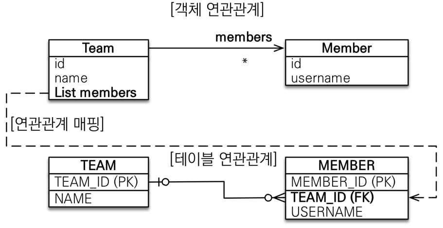

결론부터 말하자면 이런 구조는 거의 가져가지 않는다.

일대다 단뱡향은 일대다에서 일이 연관관계의 주인이 된다.

하지만, 테이블 일대다 관계에서는 항상 다쪽에 외래 키가 존재한다.

이 경우, 객체와 테이블의 차이 때문에 반대편 테이블의 외래 키를 관리하는 특이한 구조가 된다.

```java
Member member = new Member();
member.setUserName("member1");

em.persist(member);

Team team = new Team();
team.setName("teamA");
team.getMembers().add(member);

em.persist(team);
```

해당 코드를 실행했을 경우, 테이블 입장에서는 MEMBER 가 TEAM_ID 를 가지고 있기 때문에, TEAM 을 추가하기 위해 MEMBER 테이블에 UPDATE 쿼리가 추가로 나가게 된다.

```java
@Entity
public class Team {

    @Id
    @GeneratedValue
    @Column(name = "TEAM_ID")
    private Long id;

    private String name;

    @OneToMany
    @JoinColumn(name = "TEAM_ID")
    private List<Member> members = new ArrayList<>();
}
```

또한, 위처럼 일대다 관계를 갖는 컬럼에 `@JoinColumn` 을 꼭 사용해야 한다.

그렇지 않으면 TEAM_ID 와 MEMBER_ID 를 가지고 있는 중간 테이블을 하나 추가하여 조인 테이블 방식을 사용하여 외래 키를 관리하게 된다.

### 일대다 단방향 정리

일대다 단방향 매핑의 단점

- 엔티티가 관리하는 외래 키가 다른 테이블에 있음
- 연관관계 관리를 위해 추가로 UPDATE SQL 실행

때문에, 객체지향적으로 손해를 보더라도 일대다 단방향 매핑보다는 다대일 양방향 구조를 사용하는 관계로 만들어주는 것이 더 좋은 설계일 수 있다.

### 일대다 양방향

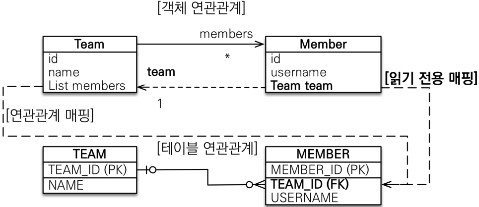

이런 매핑은 공식적으로 존재하지 않지만 만들 수는 있다.

이런 경우, `@JoinColumn(insertable=false, updatable=false)` 로 읽기 전용 필드를 사용해서 양방향 처럼 사용할 수 있다.

이런 구조를 사용하기 보다는 다대일 양방향 구조를 사용하는 것이 좋다.

## 일대일 [1:1]

---

### 일대일 관계

일대일 관계는 그 반대도 일대일이기 때문에 대칭 관계라고 생각해볼 수 있다.

때문에, 주 테이블이나 대상 테이블 중에 한 곳에서 외래 키를 선택할 수 있다.

테이블 관점에서 일대일 관계를 구현하기 위해선 외래 키에 UNI 제약조건이 추가되어야 한다.

### 주 테이블에 외래 키 단방향

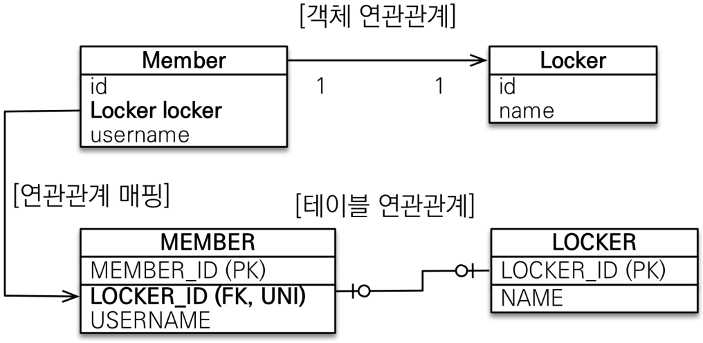

`@ManyToOne` 단방향 매핑과 유사하다는 것을 알 수 있다.

### 주 테이블에 외래 키 양방향

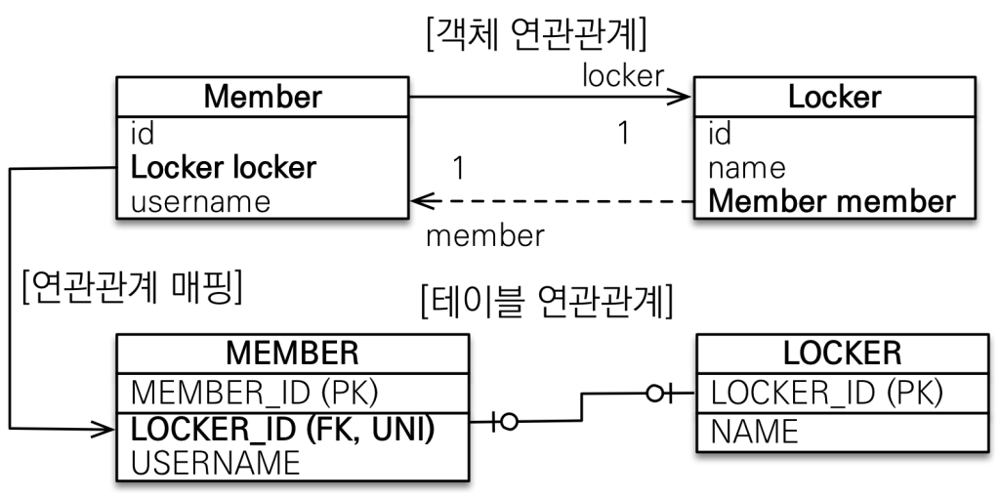

다대일 양방향 매핑 처럼 외래 키가 있는 곳이 연관관계의 주인이 되며, 반대편은 `mappedBy` 를 적용하면 된다.

### 대상 테이블에 외래 키 단방향

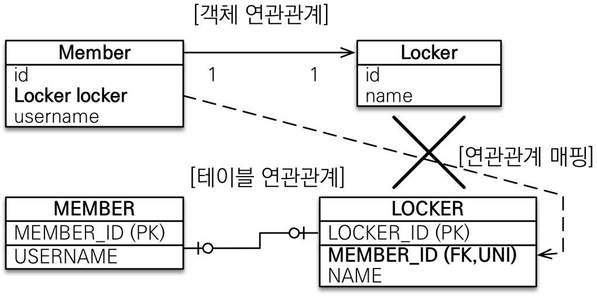

단방향 관계는 JPA 에서 지원하지 않지만, 양방향 관계는 지원한다.

MEMBER 테이블을 많이 SELECT 한다는 가정하에, MEMBER 가 LOCKER 를 가지고 있는 것이 더 효율적이다.

### 대상 테이블에 외래 키 양방향

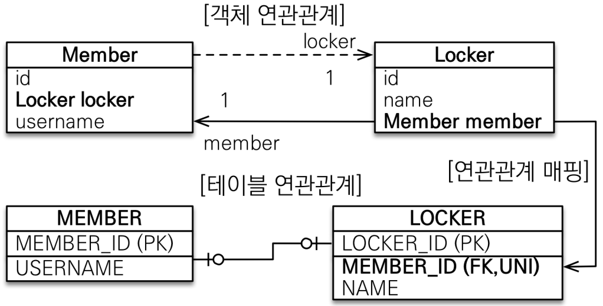

사실 일대일 주 테이블에 외래 키 양방향과 매핑 방법은 같다.

### 일대일 정리

주 테이블에 외래 키를 위치시키면, 주 객체가 대상 객체의 참조를 가지는 것 처럼 주 테이블에 외래 키를 두고 대상 테이블을 찾을 수 있다.

이는 객체지향 개발자들이 선호하는 방법이며, JPA 매핑이 편리하다는 점이 있다.

주 테이블만 조회해도 대상 테이블에 데이터가 있는지 확인이 가능하다는 장점이 있지만, 값이 없으면 외래 키에 `null` 을 허용한다는 단점 역시 존재한다.

대상 테이블에 외래 키를 위치시키면, 주 테이블과 대상 테이블을 일대일에서 일대다 관계로 변경할 때 다쪽이 되는 테이블에 이미 외래 키가 존재하기 때문에, 테이블 구조를 유지하고 변경할 수 있다는 장점이 존재한다.

하지만, 프록시 기능의 한계로 지연 로딩으로 설정해도 항상 즉시 로딩되는 단점 역시 존재한다.

## 다대다 [N:M]

---

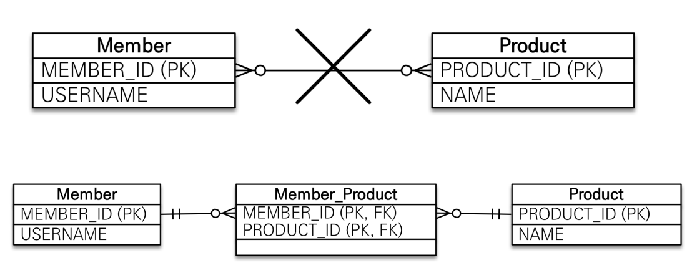

관계형 데이터베이스는 정규화된 테이블 2개로 다대다 관계를 표현할 수 없다.

이를 구현하기 위해 연결 테이블을 추가해서 일대다, 다대일 관계로 풀어내야 한다.

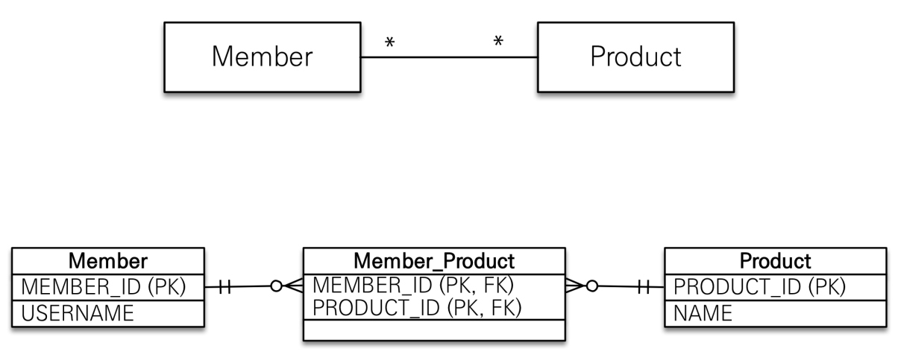

객체는 컬렉션을 사용해서 객체 2개로 다대다 관계가 가능하다.

`@ManyToMany` 와 `@JoinTable` 로 연결 테이블을 지정해서 사용해야 한다.

### 다대다 매핑의 한계

편리해 보이지만 실무에서 사용하지 않는다.

연결 테이블이 단순히 연결만 하고 끝나지 않고, 주문시간, 수량 같은 데이터가 들어올 수 있다.

### 다대다 한계 극복

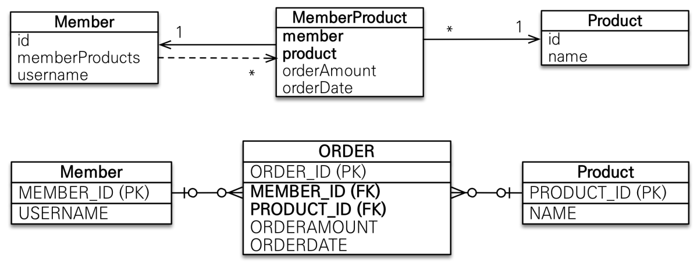

연결 테이블을 엔티티로 승격시켜 연결 테이블용 엔티티를 추가한다.

`@ManyToMany` → `@OneToMany` `@ManyToOne`

## 실전 예제 3 - 다양한 연관간계 매핑

---

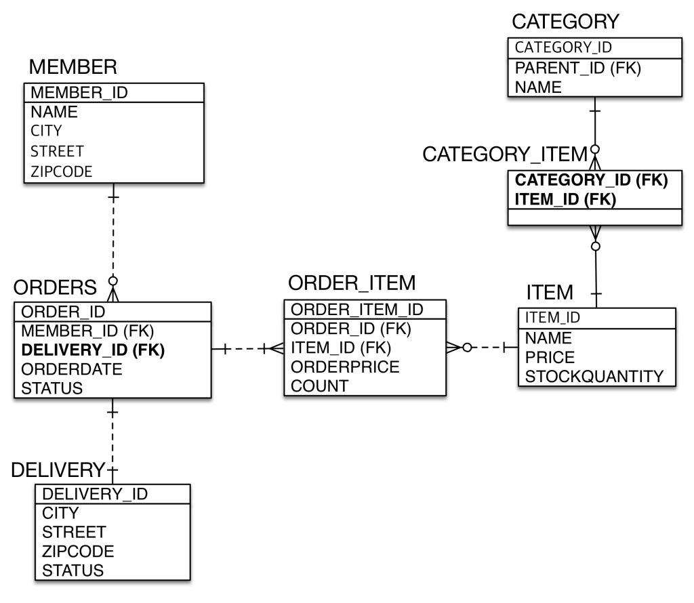

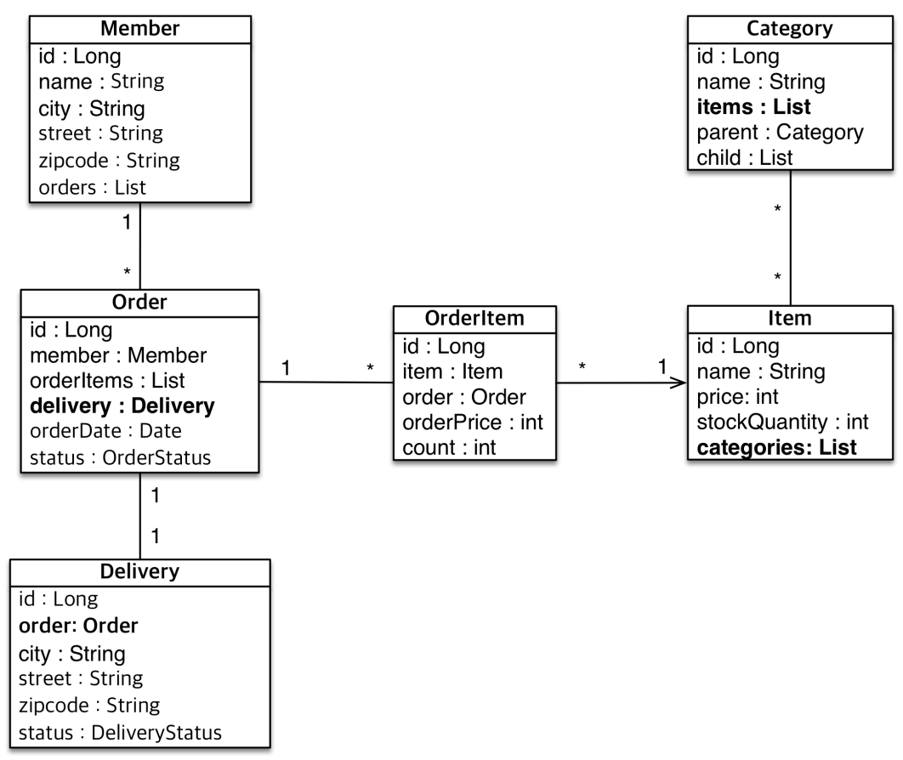

### N:M 관계는 1:N, N:1 로 변경

테이블의 N:M 관계는 중간 테이블을 이용해서 1:N, N:1 로 변경하는 것이 좋다.

실전에서는 중간 테이블이 단순하지 않기 때문에 N:M 은 사용하지 않는다.

### @JoinColumn

외래 키를 매핑할 때 사용한다.

- `name` 매핑할 외래 키 이름
- `referencedColumnName` 외래 키가 참조하는 대상 테이블의 컬럼명
- `foreignKey(DDL)` 외래 키 제약조건을 직접 지정할 수 있음
- `unique` `nullable` `insertable` `updatable` `columnDefinition` `table` @Column 의 속성과 같음

### @ManyToOne

다대일 관계 매핑 시 사용한다.

- `optional` false 로 설정 시 연관된 엔티티가 항상 있어야 함
- `fetch` 글로벌 페치 전략을 설정
- `cascade` 영속성 전이 기능을 사용
- `targetEntity` 연관된 엔티티 타입 정보를 설정. 제네릭으로 타입 정보를 알 수 있기 때문에 거의 사용하지 않음

### @OneToMany

다대일 관계 매핑 시 사용한다.

- `mappedBy` 연관관계의 주인 필드를 선택
- `fetch` 글로벌 페치 전략을 설정
- `cascade` 영속성 전이 기능을 사용
- `targetEntity` 연관된 엔티티 타입 정보를 설정. 제네릭으로 타입 정보를 알 수 있기 때문에 거의 사용하지 않음