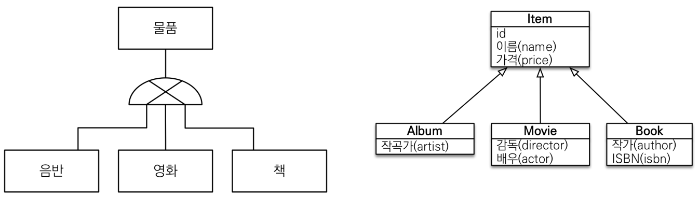
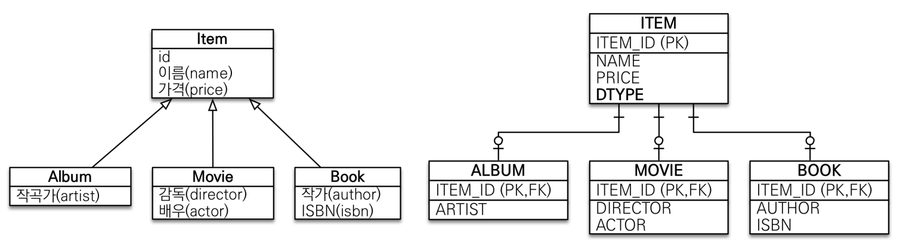
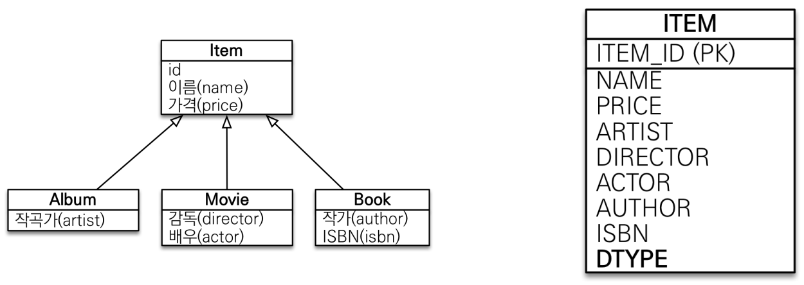
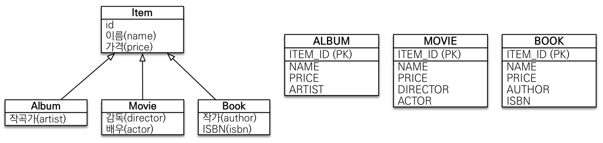
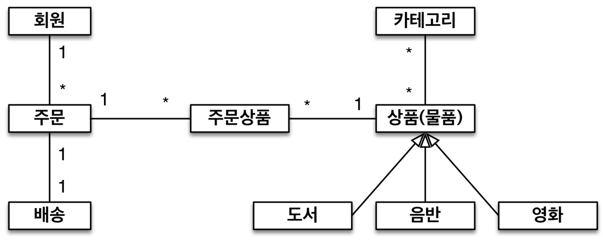
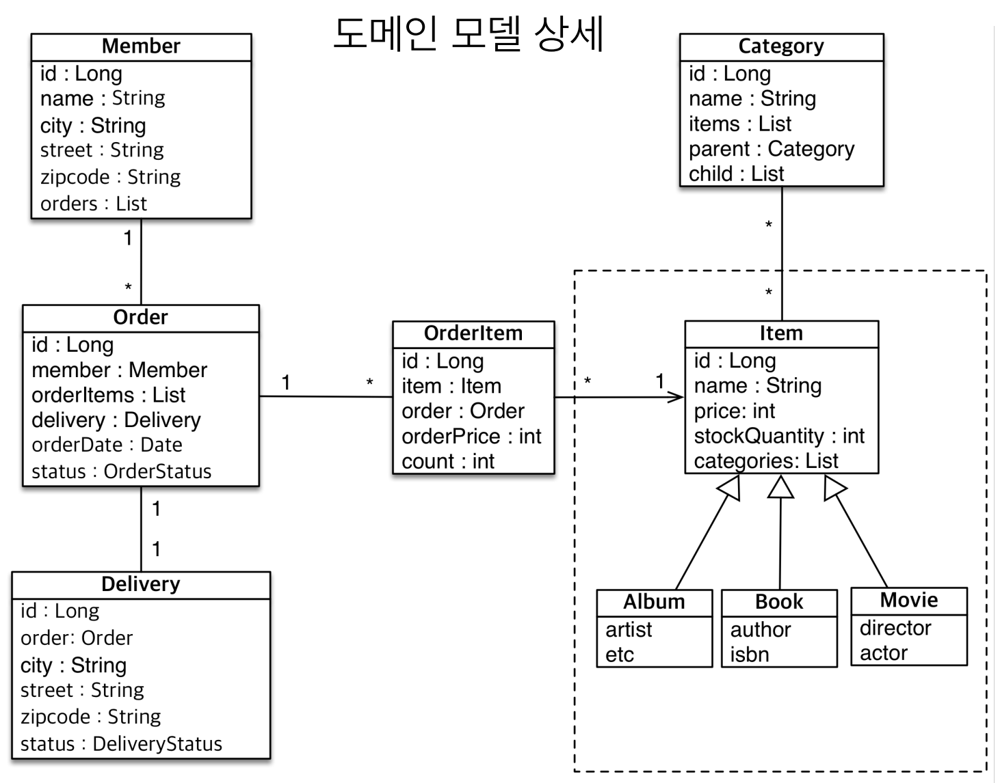
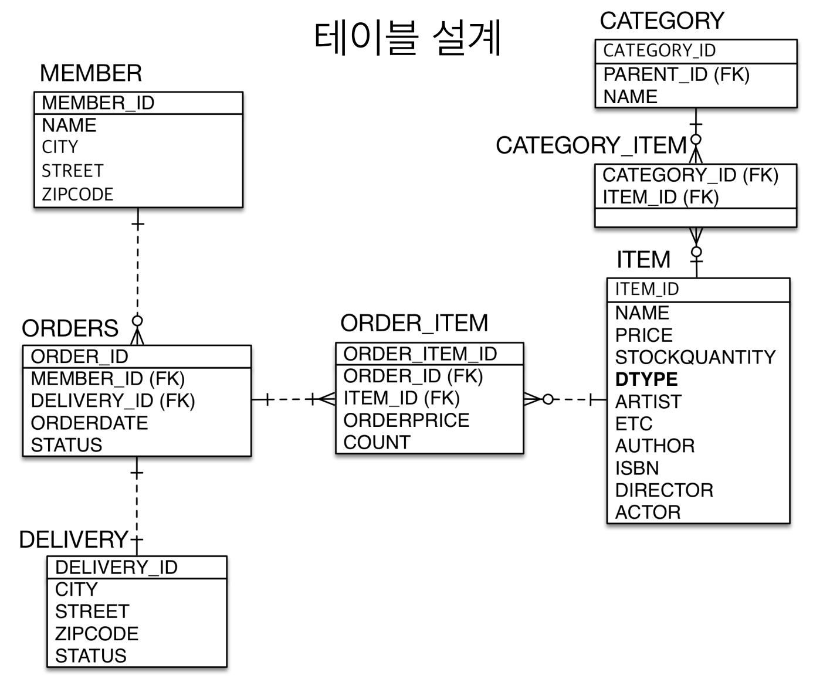

# 7. 고급 매핑

## 상속관계 매핑

---



객체는 상속관계가 있지만 RDB 에는 상속관계가 없다.

RDB 의 슈퍼타입 서브타입 관계라는 모델링 기법이 객체의 상속과 유사하다.

즉, 상속관계 매핑이란, 객체의 상속구조와 RDB 의 슈퍼타입 서브타입 관계를 매핑하는 것을 의미한다.

슈퍼타입 서브타입 논리 모델을 실제 물리 모델로 구현하는 법은 총 3가지가 존재한다.

1. 조인 전략
2. 단일 테이블 전략
3. 구현 클래스마다 테이블 전략

### 조인 전략

`@Inheritance*(*strategy = InheritanceType.JOINED*)*`



`@DiscriminatorColumn(name = "DTYPE")` 기본값은 "DTYPE" 이며, 자식 테이블을 구분하기 위해 DTYPE 이 추가되는 것이 좋다.

`@DiscriminatorValue("XXX")` 기본값은 "클래스명" 이며, 자식 테이블의 테이블명을 명시해주고 싶을 때 사용할 수 있다.

조인 전략의 장점으로는, 테이블이 정규화 되어있고, 외래 키 참조 무결성 제약조건을 활용할 수 있으며, 효율적으로 저장공간을 사용할 수 있다는 점이 있다.

반면, 단점으로는, 조회 시 조인을 많이 사용되어 성능이 저하되고, 데이터 저장 시 INSERT 쿼리가 2번 호출되는 점이 있다.

객체의 상속과 가장 유사하기 때문에 기본적으론, 조인 전략이 정석이라고 생각하는 것이 좋다.

### 단일 테이블 전략

`@Inheritance*(*strategy = InheritanceType.SINGLE_TABLE*)*`



단일 테이블 전략은 모든 자식 테이블 요소를 한 테이블에서 관리하기 때문에 자식 테이블을 구분하기 위하여DTYPE 를 자동으로 추가해준다.

단일 테이블 전략의 장점으로는, 조인이 필요 없기에 일반적으로 조회가 빠르다는 점이 있다.

반면, 단점으로는, 자식 엔티티가 매핑한 컬럼은 모두 null 을 허용해야하며, 단일 테이블에 모든 것을 저장하기 때문에 상황에 따라 조회 성능이 오히려 느려질 수 있다는 점이 있다.

### 구현 클래스마다 테이블 전략

`@Inheritance*(*strategy = InheritanceType.TABLE_PER_CLASS*)*`



부모 테이블이 없기 때문에 `Item` 타입으로 조회 시 모든 자식 테이블을 뒤져서 결과를 찾는다.

이 전략은 사용하지 않는 것이 좋다.

## @MappedSuperclass - 매핑 정보 상속

---

```java
@MappedSuperclass
public abstract class BaseEntity {

    private String createdBy;
    private LocalDateTime createdDate;
    private String lastModifiedBy;
    private LocalDateTime lastModifiedDate;
}
```

공통 매핑 정보가 필요할 때 사용한다. 즉, 속성만 상속받아서 쓰고 싶을 때 사용한다.

테이블과 관계 없이 단순히 엔티티가 공통으로 사용하는 매핑 정보를 모으는 역할이다.

주로 등록일, 수정일, 등록자, 수정자 같은 전체 엔티티에서 공통으로 적용하는 정보를 모을 때 사용한다.

직접 생성해서 사용할 일이 거의 없기 때문에 추상 클래스를 권장한다.

## 실전 예제 4 - 상속관계 매핑

---

### 도메인 모델





